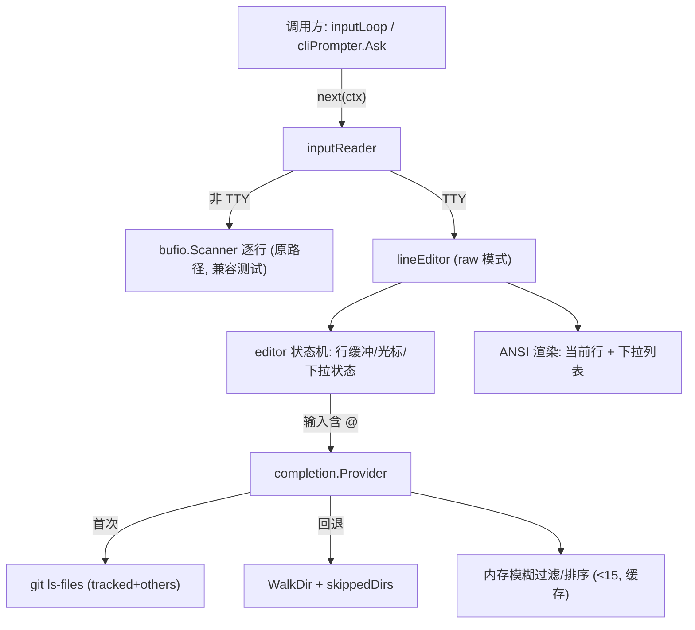

## 产品概述

为 cogent 终端交互（`run`/`resume` 主 REPL 及权限交互 HITL 等所有 stdin 输入点）新增 `@` 文件补全能力：用户在输入行中键入 `@` 时，实时弹出可导航的文件下拉框，边打字边模糊过滤，选中后把 `@` 后的片段替换为工作区相对路径（保留 `@` 前缀，如 `@internal/tool/grep.go`）。交互形态对齐 Claude Code。

## 核心功能

- **触发与解析**：输入行中光标前最近的 `@` 到光标间的 token 作为待匹配片段（遇空白终止），出现 `@` 即触发下拉。
- **实时下拉框**：raw 模式逐键渲染当前行 + 下方候选列表（最多 15 条），高亮当前项，随输入即时重算并过滤。
- **键位操作**：↑/↓ 或 Ctrl-P/Ctrl-N 导航；Tab/Enter 选中并写回；Esc 关闭下拉（保留已输入内容）；无下拉时 Enter 提交整行；Backspace/普通字符正常编辑；Ctrl-C 中断、Ctrl-D 结束输入。
- **候选来源**：优先 `git ls-files`（含未跟踪 `--others --exclude-standard`），非 git 仓库或失败时回退目录遍历（跳过 `.git`/`.cogent`/`node_modules` 等噪声目录），路径相对工作区根，模糊匹配排序，上限 15。
- **写回行为**：把 `@partial` 替换为 `@相对路径`，光标移至路径末尾，下拉关闭。
- **非终端回退**：stdin 非 TTY（管道、`strings.NewReader`、脚本）时不进 raw 模式，退回逐行读取，`@` 不触发下拉，保证脚本与既有单测行为不变。

## 技术栈选择

- 语言：Go（现有工程，module `github.com/alaindong/cogent`），遵循 Google Go 规范与用户编码规范。
- raw 终端模式：复用**已有依赖** `golang.org/x/sys/unix`（v0.45.0，当前为 indirect）实现 termios 原始模式（`IoctlGetTermios`/`IoctlSetTermios`，darwin 用 `TIOCGETA`/`TIOCSETA`），仅将其提升为 direct require。刻意不引入 `golang.org/x/term`（模块缓存中不存在，存在离线/网络下载风险，见项目环境坑）。
- 候选来源：复用 `internal/engine/snapshot.go` 既有 git 调用范式 `exec.CommandContext(ctx, "git", ...)` + `cmd.Dir = workRoot`；回退遍历参照 `internal/tool/findfiles.go` 的 `filepath.WalkDir` + `skippedDirs`。
- CLI 渲染：ANSI 转义序列（清行、光标移动、反显高亮），无需第三方 TUI 库。

## 实现思路

采用 **readline 风格的“逐调用 raw 模式”行编辑器**：仅在等待/编辑输入期间进入 raw 模式，读到整行提交后立即恢复 cooked 模式；助手流式输出（`consumeEvents`）阶段终端处于 cooked 模式，`fmt.Print` 换行行为不变，避免全程 raw 带来的输出错位问题。这是最小侵入且稳健的做法（对齐 peterh/liner、chzyer/readline 的成熟实践）。

关键决策与权衡：

- **Ctrl-C 语义**：raw 模式关闭 ISIG，Ctrl-C 以字节 `0x03` 到达，由编辑器直接识别并返回中断信号；输入等待之外（流式输出时）终端为 cooked，Ctrl-C 仍走 `main` 的 `signal.NotifyContext` → ctx 取消。二者互补，覆盖全链路优雅退出。
- **性能（热路径）**：`git ls-files` 只在**首次触发 `@` 时**拉取一次并缓存（带短 TTL），后续每次按键仅在内存中做模糊过滤 + 排序 + 截断（≤15），避免每次击键 spawn git/遍历磁盘（防 N 次进程创建）。大仓库遍历回退设条目上限。
- **可测试性**：将纯逻辑（`@` token 解析/写回、候选过滤排序、按键状态机）与 raw I/O + ANSI 渲染解耦，纯函数直接单测，不依赖 TTY。
- **向后兼容**：`newInputReader(io.Reader)` 签名与非 TTY Scanner 分支保持不变，`prompter_test.go` 中 `strings.NewReader` 走原路径，无需改测试即通过。

## 实现要点（执行细节）

- **TTY 检测**：仅当底层是 `*os.File` 且 `unix` 判定为终端时启用编辑器；否则一律走现有后台 `bufio.Scanner`。
- **终端恢复安全**：进入 raw 后用 `defer` 恢复；对 panic/异常路径确保恢复，避免终端残留异常状态。
- **提示符**：调用方（`you> `、HITL 的 `[a/A/e/r]` 等）仍先打印提示符，编辑器只管理提示符之后的可编辑区与其下方的下拉渲染（渲染后用光标保存/恢复 + 清行回到编辑行）。
- **候选路径**：相对 `workRoot`（`filepath.Rel`），目录可带尾分隔符；过滤优先级 前缀匹配 > 子串 > 子序列，再按路径长度升序。
- **日志**：git/遍历失败静默回退（不阻断输入），必要时用现有 `slog` 记 debug，不打印敏感内容、不刷屏。
- **workRoot 注入**：`runREPL`/`runGoalCmd`/`runLoopCmd` 均已有 `wd, _ := os.Getwd()`，构造 TTY 感知的 inputReader 时传入以支撑候选来源。

## 架构设计



## 目录结构

```
cogent/
├── internal/
│   └── completion/
│       ├── provider.go        # [NEW] 文件候选来源。git ls-files(tracked)+ls-files --others --exclude-standard 优先，失败/非 git 回退 filepath.WalkDir(参照 findfiles，跳过 skippedDirs)；首次触发拉取并缓存(短 TTL)，提供 Filter(partial) 内存模糊过滤+排序+截断(15)，路径相对 workRoot。exec.CommandContext + cmd.Dir=workRoot。
│       ├── token.go           # [NEW] 纯函数：ParseAtToken(line []rune, cursor int)->(start,partial,active) 解析光标前最近 @ token(遇空白终止)；ApplyChoice(line,cursor,start,partial,choice)->(newLine,newCursor) 保留 @ 前缀替换为 @相对路径并定位光标。
│       └── completion_test.go # [NEW] token 解析/写回边界用例 + provider 过滤排序(用临时目录/临时 git repo)单测。
├── cmd/cogent/
│   ├── lineeditor.go          # [NEW] raw 模式交互式行编辑器(package main)。termios(x/sys/unix)进出+defer 恢复；editor 状态机 handleKey(按键->动作)；render() 用 ANSI 渲染当前行+下拉高亮；同步逐字节读取循环，处理 ↑↓/Ctrl-P/N、Tab/Enter、Esc、Backspace、普通字符、Ctrl-C(0x03)/Ctrl-D(0x04)；集成 completion。isTerminal(fd) 检测。
│   ├── lineeditor_test.go     # [NEW] editor 状态机纯逻辑单测：喂按键序列->行/光标/下拉状态断言(不依赖 TTY)。
│   ├── prompter.go            # [MODIFY] inputReader 增加 TTY 模式：保留 newInputReader(io.Reader) Scanner 分支不变(测试兼容)；新增携带 *os.File+workRoot 的构造/选项，next(ctx) 在 TTY 时走 lineEditor 读一行，非 TTY 走原 Scanner。
│   ├── commands.go            # [MODIFY] runREPL 中构造 TTY 感知 inputReader 并传入 wd(workRoot)。
│   ├── goal.go                # [MODIFY] runGoalCmd 同上(HITL @ 补全)。
│   └── loop.go                # [MODIFY] runLoopCmd 同上(HITL @ 补全)。
└── go.mod                     # [MODIFY] 将 golang.org/x/sys 由 indirect 提升为 direct require(无新增下载)。
```

## 关键接口（示意，签名级）

```
// internal/completion/token.go
// ParseAtToken 解析光标前最近的 @ 触发 token；active 为假表示当前无 @ 补全上下文
func ParseAtToken(line []rune, cursor int) (start int, partial string, active bool)

// ApplyChoice 将 @partial 替换为 @choice(相对路径)，返回新行与新光标位置
func ApplyChoice(line []rune, cursor, start int, partial, choice string) (newLine []rune, newCursor int)

// internal/completion/provider.go
// Provider 提供工作区文件候选：首次拉取并缓存，Filter 在内存中模糊过滤
type Provider interface {
    Filter(ctx context.Context, partial string, limit int) []string
}
```