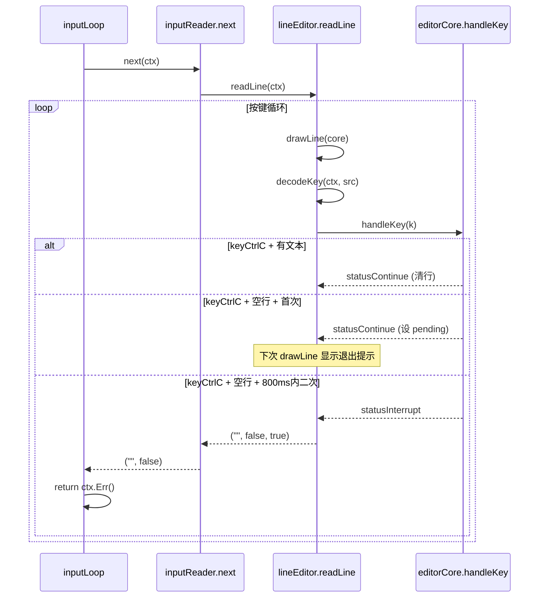

## 用户需求

修复 cogent REPL 的三个交互体验问题：

1. **Bug 1（效果一般）**：@ 补全下拉渲染虽已从 DECSC/DECRC 改为相对光标移动，但实际终端显示仍有问题——提示符 `you> ` 在重绘时被清除、候选行数过多显得冗长、光标定位偏移不正确
2. **Bug 2（未修复）**：Ctrl-C 在空行时仍然直接退出 cogent，用户期望参考 claude-code 的双击退出机制
3. **Bug 3（新发现）**：输入中文时光标定位错误——光标停在最后一个字的左边而非右边。原因：`drawLine` 用 rune 数量（`core.cursor`）做 `\x1b[%dC` 右移列数，但中文字符占 2 列终端宽度

## 产品概述

cogent 是一个 Go 编写的自主编码 Agent 运行时 CLI，用户通过交互式 REPL 与 Agent 多轮对话。REPL 支持 raw 模式行编辑、@ 文件补全下拉、斜杠命令、历史导航等能力。

## 核心特性

- **Ctrl-C 双击退出**：参考 claude-code，第一次 Ctrl-C 清行（有内容时）或显示"再按一次退出"提示（空行时），800ms 内第二次 Ctrl-C 才真正退出
- **下拉渲染修正**：drawLine 重绘时保留 `you> ` 提示符，光标定位正确计算前缀偏移，候选数从 8 行降为 5 行更紧凑
- **CJK 宽字符光标定位**：光标右移列数改用显示宽度（`displayWidth`）而非 rune 计数，复用项目已有的 `internal/render.runeWidth`

## Tech Stack

- Go (已有项目)
- 终端 raw mode + ANSI escape sequences
- 无外部依赖新增

## Implementation Approach

### Bug 2 修复方案：双击 Ctrl-C 退出

参考 claude-code 的 `useDoublePress`（800ms 时间窗口），在 `editorCore` 状态机中实现：

1. `editorCore` 新增 `lastCtrlCAt time.Time` 和 `ctrlCPending bool` 字段
2. `handleNormalKey` 中 `keyCtrlC` 分三种情况：

- 有文本或下拉激活 → 清行 + 关闭下拉 + 清除 pending（不变）
- 空行且 `ctrlCPending` 且距 `lastCtrlCAt` 在 800ms 内 → `statusInterrupt`（真正退出）
- 空行首次（或已超时） → 设置 `ctrlCPending=true`、`lastCtrlCAt=now`，返回 `statusContinue`

3. `drawLine` 时如果 `ctrlCPending`，在输入行下方渲染灰色提示 `(press Ctrl-C again to exit)`
4. 任何非 Ctrl-C 按键处理前，先清除 `ctrlCPending`

**关键决策**：不新增 `editorStatus` 枚举值，保持状态机简洁——pending 状态仅通过 `ctrlCPending` 布尔标记 + 时间戳在 `editorCore` 内部管理，对 `readLine` 循环透明。

### Bug 1 修复方案：drawLine 提示符感知

当前 `drawLine` 的 `\r\x1b[0J`（回行首+清到屏末）会擦掉 `inputLoop` 打印的 `you> ` 前缀。修复：

1. `lineEditor` 新增 `promptWidth int` 字段（值为 `len("you> ")` = 4）
2. `newLineEditor` 或 `readLine` 入口接收提示符宽度参数
3. `drawLine` 改为：

- 上移回到输入行（不变）
- `\r` 回行首 → `\x1b[<promptWidth>C` 跳过提示符 → `\x1b[0J` 只清提示符之后
- 写用户输入 + 下拉（不变）

4. 光标定位：`\r` + `\x1b[<promptWidth + displayWidth(line[:cursor])>C`
5. `finishLine` 同样调整
6. `maxVisibleSuggest` 从 8 降为 5

### Bug 3 修复方案：CJK 宽字符光标定位

`drawLine` 中光标右移用 `\x1b[%dC` 时列数必须是**显示宽度**而非 rune 数。项目已有 `internal/render` 包的 `runeWidth(r rune) int` 函数（对 CJK/全角返回 2，其余返回 1）。

修复点（全在 `cmd/cogent/lineeditor.go`）：

1. 新增 `displayWidth(line []rune, pos int) int` 辅助函数：计算 `line[:pos]` 的终端显示列宽（累加每个 rune 的 `runeWidth`）
2. `drawLine` 第 509-510 行：`core.cursor` → `displayWidth(core.line, core.cursor)`
3. 同样在 `finishLine` 中如有光标定位也需改用 displayWidth
4. 由于 `render.runeWidth` 是非导出函数，需要在 `lineeditor.go` 内复制一份轻量版（或将 `render.runeWidth` 改为导出 `RuneWidth`）

**性能注意**：所有 ANSI 渲染通过 `strings.Builder` 一次性拼接后单次 `io.WriteString` 输出（已是如此），避免闪烁。

## Implementation Notes

- `time.Now()` 用于双击计时，精度足够（毫秒级），无需 monotonic clock 特殊处理（Go 的 `time.Time` 已默认含 monotonic reading）
- `ctrlCPending` 的 800ms 超时不需要后台 goroutine 定时器——只需在下一次按键到来时检查是否超时并清除即可（惰性清除）
- `promptWidth` 硬编码为 `len("you> ")` 即可，因为 `inputLoop` 中提示符是固定字符串；如果未来需要动态提示符，改为参数传入
- `drawLine` 中 pending 提示渲染计入 `drawnDropdownLines`，确保下次清除时能正确回退
- CJK 宽字符宽度判定逻辑直接在 `lineeditor.go` 中实现一个本地 `runeDisplayWidth` 函数（与 `internal/render.runeWidth` 相同逻辑），避免 `cmd/cogent` 对 `internal/render` 包产生不必要的导入依赖

## Architecture Design



## Directory Structure

```
cmd/cogent/
├── lineeditor.go         # [MODIFY] editorCore 增加双击 Ctrl-C 字段与逻辑；drawLine/finishLine 增加 promptWidth 感知 + displayWidth 宽字符；maxVisibleSuggest 改为 5
├── commands.go           # [MODIFY] inputLoop 传递 promptWidth 到 lineEditor（可选，或硬编码在 lineEditor 内部）
└── lineeditor_test.go    # [MODIFY] 新增双击 Ctrl-C 逻辑 + 宽字符光标定位的单测
```

## Key Code Structures

```
// editorCore 新增字段（cmd/cogent/lineeditor.go）
type editorCore struct {
    // ... 现有字段 ...
    ctrlCPending bool      // 是否处于双击退出等待状态
    lastCtrlCAt  time.Time // 上次空行 Ctrl-C 的时间戳
}

// lineEditor 新增字段
type lineEditor struct {
    // ... 现有字段 ...
    promptWidth int // 提示符宽度（如 "you> " = 4），用于 drawLine 定位
}
```