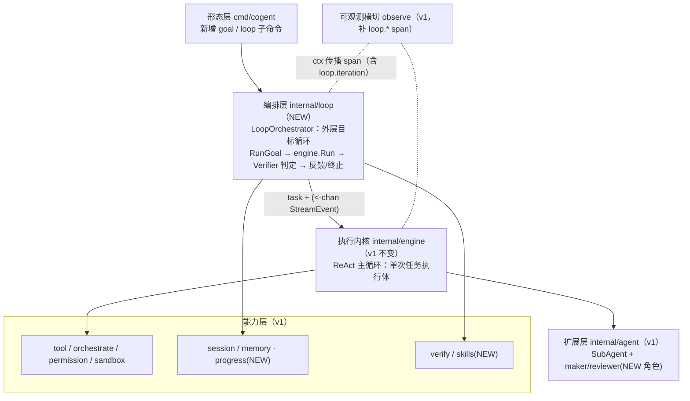

# Cogent · Loop Engineering 改造设计 — LOOP_SPEC

> 版本 0.1（v2 演进方向）｜代号 `cogent-loop`｜主语言 **Golang**
> 定位：把 `cogent` 从**单次任务执行内核（Boris Cherny 的「高度 2」）**演进为**持续自治的 Loop 引擎（「高度 3」）**。
> 关系：本文档是 [`DEV_SPEC.md`](./DEV_SPEC.md)（v1，已 100% 完成）的**叠加增量**——v1 一行不改，v2 在其 `engine` 之上加一层编排，详见 §9。

## 目录
1. [定位与目标（高度2 → 高度3）](#1-定位与目标高度2--高度3)
2. [Loop 范式与六原语映射现状](#2-loop-范式与六原语映射现状)
3. [总体架构（LoopOrchestrator 叠加层）](#3-总体架构looporchestrator-叠加层)
4. [逐项详设](#4-逐项详设)
   - 4.1 [`/goal` 目标循环（P0 核心）](#41-goal-目标循环p0-核心)
   - 4.2 [maker / reviewer 双角色（P0）](#42-maker--reviewer-双角色p0)
   - 4.3 [Automations 心跳（P1）](#43-automations-心跳p1)
   - 4.4 [State：progress.md 看板（P1）](#44-stateprogressmd-看板p1)
   - 4.5 [Worktrees 并行隔离（P2）](#45-worktrees-并行隔离p2)
   - 4.6 [Skills：SKILL.md（P2）](#46-skillsskillmdp2)
   - 4.7 [Connectors：MCP 跨进程 trace 传播（P2）](#47-connectorsmcp-跨进程-trace-传播p2)
5. [安全衔接](#5-安全衔接)
6. [可观测衔接](#6-可观测衔接)
7. [测试方案](#7-测试方案)
8. [分阶段排期与进度跟踪](#8-分阶段排期与进度跟踪)
9. [与 DEV_SPEC 的关系（v1 不变，v2 叠加）](#9-与-dev_spec-的关系v1-不变v2-叠加)

---

## 1. 定位与目标（高度2 → 高度3）

### 1.1 一句话

> Loop Engineering 的核心命题：**你不应再手动给 coding agent 写 prompt，而应设计一个 loop 去替你 prompt agent。** 模型退化为「子程序」，人升级为「loop 的作者」。

`cogent` v1 已是一台优秀的**单次任务执行内核**：人给一个明确任务 → 跑一轮 ReAct 闭环（探索→改→执行→验证→自我修正）→ 结束。但它停在「人点一下、跑一次」的命令式形态。Loop Engineering 要求的是**持续自治的运行系统**：人只定义 **loop + 可验证目标（goal）**，系统自己发现工作、自己派出实现者/审查者、跑到「目标达成（green）」才停。

### 1.2 三个高度（Boris Cherny 阶梯）与 cogent 的位置

| 高度 | 形态 | 人的角色 | cogent 现状 |
| --- | --- | --- | --- |
| 高度 1 | 手写代码 + 自动补全 | 执行者（在 loop 内） | — |
| 高度 2 | 并行指挥多个 Agent 会话 | 决策者 | **← cogent v1 在这里** |
| 高度 3 | 编写 Loop 替你 prompt Agent | 系统设计者（在 loop 外） | **← v2 目标** |

### 1.3 v2 的设计目标（可验收）

1. **目标驱动终止**：从「撞护栏才停」（maxSteps/超时/熔断）升级为「**达目标才停**」——给定可验证终止条件，持续迭代直到满足或撞预算。
2. **独立判定**：完成是**证明**而非声明——由**独立于执行体的判定器**（写代码的 Agent 不给自己打分）裁决。
3. **制造-审查分离**：引入 maker（可写实现者）/ reviewer（只读审查者）双角色，「不批改自己的作业」。
4. **持续自治**：可被定时/事件**心跳**唤醒，跨多个 run 用磁盘 `progress.md` 追踪待办（仓库不忘记）。
5. **预算护栏先行**：任何自治循环必须先有 **max iterations / max cost / max wall-clock** 三重护栏，杜绝 AutoGPT 式失控烧钱。
6. **零破坏叠加**：以上全部以 `engine` 之上的新编排层实现，**不重写内核、不分叉主循环、依赖方向保持无环**。

### 1.4 非目标（明确不做 / 留后）

- 不做分布式多机编排（与 v1 §1.2「不内置 Remote/Bridge/Swarm」一脉相承）。
- 不做重型工作流 DSL / 可视化编排器；loop 的描述用 Go 类型 + 配置文件即可。
- 不引入向量库做 State；`progress.md` 走纯文件清单 + 轻量召回（沿用 v1 Memory 取舍）。

---

## 2. Loop 范式与六原语映射现状

Addy Osmani 总结的 Loop **六原语** + 最关键的 `/goal`，对照 cogent v1 的完成度（已核验 `internal` 非测试代码）：

| # | 原语 | 作用 | cogent v1 现状 | 完成度 | 主要缺口 |
| --- | --- | --- | --- | --- | --- |
| ④ | **Connectors**（MCP） | 通过 MCP 触达真实世界 | 自实现 stdio JSON-RPC client，`mcp__<server>__<tool>` 命名隔离 + 内建优先 + fail-closed | 🟢 ~90% | 跨进程 trace 传播（W3C traceparent）未做 |
| ⑥ | **State**（磁盘记忆） | 记忆写磁盘而非上下文 | session JSONL（resume）+ MEMORY.md | 🟡 ~60% | 缺跨多 run 的 `progress.md` 持续待办看板 |
| ⑤ | **Sub-agents**（制造/审查分离） | 写与审分离 | `agent.SubAgent` 隔离派发（只读探索 + 摘要回流） | 🟡 ~40% | 只读、无 maker/reviewer 分离 |
| ③ | **Skills**（意图固化到磁盘） | 把约定/流程固化为可复用单元 | 仅 MEMORY.md；§2.4 主动砍掉 Skills 全套 | 🟠 ~20% | 无 `SKILL.md` 可复用技能包 |
| ② | **Worktrees**（并行隔离） | git worktree 物理隔离防互相覆盖 | 单 `WorkRoot` + `ValidatePath` 路径约束（非隔离） | 🔴 ~5% | 完全缺失 |
| ① | **Automations**（心跳） | 定时/事件触发，持续发现工作 | 无；命令式一次性 `Run` | 🔴 0% | 完全缺失（最大缺口） |
| ⭐ | **`/goal`**（可验证终止 + 独立判定） | 跑到目标达成才停 | maxSteps/超时/熔断护栏 + Plan 模式 + eval `verify.sh` | 🟡 ~35% | 「撞护栏才停」非「达目标才停」，判定器未接回主循环 |

> **结论**：cogent v1 站在「高度 2」，Loop 要求「高度 3」。缺的正是把「一次性内核」升级为「自驱动循环」的**编排层**——而非重写内核。本文档据此排期：**P0**（`/goal` + maker/reviewer，杠杆最高）→ **P1**（Automations + progress.md）→ **P2**（Worktrees + Skills + traceparent）。

---

## 3. 总体架构（LoopOrchestrator 叠加层）

### 3.1 核心决策：叠加而非重写

新增包 `internal/loop`，承载 **LoopOrchestrator** 外层编排循环。它**消费** `engine.Engine` 的 `Run` 与事件流，把「执行一轮 → 独立判定 → 不达标带反馈继续」接成外层循环。`engine` 对 `loop` **零感知、零反向依赖**——守住 v1 §4.4「依赖只能向内」。



### 3.2 依赖方向（延续 v1 §4.4，新增节点不破环）

```text
cmd/cogent ──▶ loop(NEW) ──▶ engine ──▶ {llm, tool, orchestrate, contextmgr, memory, session} ──▶ types
                  │             │
                  │             └─▶ {permission, sandbox}（被 tool 依赖）
                  ├─▶ verify(NEW) · progress(NEW)（仅依赖 types / 标准库）
                  └─▶ agent ──▶ engine（maker/reviewer 复用子 Engine）
所有层 ┄┄▶ observe（薄接口）      所有层 ──▶ types（最内层）
```

- **关键不变量**：`loop → engine` 单向。`loop` 可以 import `engine`、`agent`、`verify`、`progress`；但 `engine` 绝不 import `loop`。这样 v1 内核可独立编译/测试，v2 是可裁剪的外挂层。
- `verify` / `progress` / `skills` 作为**叶子包**只依赖 `types` 与标准库，便于单测注入替身。

### 3.3 架构不变量延续（v1 §4.4 全部继承 + 新增）

| 不变量 | 在 v2 的体现 |
| --- | --- |
| 单一真相源 | 单次任务的消息状态仍只在 `engine`；loop 只持有「跨轮目标 + 反馈 + 预算账本」，不碰 engine 内部 msgs |
| ctx 一条到底 | 顶层 ctx 经 loop 传入 engine，再到工具/子进程；`Ctrl-C` 取消即贯穿外层循环与内层 ReAct |
| 事件单向上抛 | loop 向 CLI 上抛 `LoopEvent`（含内层透传的 `StreamEvent`），无反向回调 |
| 工具池运行期只读 | maker/reviewer 各自启动期装配池，运行期不可变 |
| function calling 配对完整 | loop 不拆改 engine 的消息；反馈以**新一轮 user task** 注入，不破坏既有配对 |
| fail-closed | 预算护栏默认收紧；Verifier 缺省即「未通过」；reviewer 缺省即「拒绝」 |
| **（新）独立判定** | 判定器与执行体分离，执行体无法篡改判定结果 |
| **（新）预算先行** | 无 `Budget` 不得启动自治循环；撞顶即停并落盘可恢复点 |

---

## 4. 逐项详设

> 每项遵循统一结构：**问题 → Loop 要求 → cogent 的 Go 实现/接口草案 → 与现有包对接 → 可深挖点**。所有接口为**签名级草案**（导出符号带注释、error 末位、参数 ≤5），落地实现留待编码阶段。

### 4.1 `/goal` 目标循环（P0 核心）

**问题**：v1 的终止条件是「撞护栏才停」——`maxSteps` 到顶、模型不再请求工具、ctx 取消、compact 熔断。这回答的是「还能不能跑」，而非「任务到底完没完成」。模型完全可能「自我宣告完成」却留下编译不过的代码。

**Loop 要求**：给定一个**可验证终止条件**（如「`go test ./...` 全绿且目标函数存在」），Agent **持续迭代直到条件满足**；判定由**独立小模型/脚本**完成，写代码的 Agent 不给自己打分。

**cogent 的 Go 实现（新增 `internal/loop` + `internal/verify`）**：

```go
// Package loop 在 engine 之上实现目标驱动的外层自治循环（LOOP_SPEC §4.1）。
// 它消费 engine.Engine 的单次执行能力，把「执行一轮 → 独立判定 → 不达标带反馈继续」
// 接成外层循环；engine 对 loop 零反向依赖（守 DEV_SPEC §4.4 依赖向内）。
package loop

// Goal 描述一次目标驱动循环的输入：自然语言意图 + 可验证的终止条件。
type Goal struct {
	Intent     string // 给 Agent 的自然语言目标，如「修复 X 并保证全部测试通过」
	WorkRoot   string // 工作根目录，传给内层 engine 与 Verifier
	Verifier   verify.Verifier // 独立终止条件判定器；nil 时 fail-closed 视为永不达标
	Budget     Budget          // 预算护栏；零值时用保守默认（见 DefaultBudget）
}

// Budget 是自治循环的三重失控护栏（呼应 DEV_SPEC §7.8）。任一触顶即终止。
type Budget struct {
	MaxIterations int           // 外层循环最大轮数（每轮 = 一次 engine 执行 + 一次判定）
	MaxCostUSD    float64       // 累计 LLM 成本上限（由 observe 计量喂入）；0 表示不限
	MaxWallClock  time.Duration // 端到端墙钟上限；0 表示不限
}

// DefaultBudget 返回保守默认护栏：宁可早停，不可失控烧钱（fail-closed）。
func DefaultBudget() Budget {
	return Budget{MaxIterations: 8, MaxCostUSD: 5, MaxWallClock: 15 * time.Minute}
}

// Outcome 是目标循环的结局枚举。
type Outcome int

// 目标循环结局枚举。
const (
	OutcomeAchieved   Outcome = iota // 判定器确认目标达成（唯一成功结局）
	OutcomeBudgetSpent                // 撞预算护栏（轮数/成本/墙钟）
	OutcomeCanceled                   // ctx 取消
	OutcomeFatal                      // 内层不可恢复错误
)

// LoopResult 汇总一次目标循环的结局与归因，便于上层渲染与评估。
type LoopResult struct {
	Outcome    Outcome
	Iterations int       // 实际执行轮数
	LastReport verify.Report // 最后一次判定报告（含未达标原因）
	SpentUSD   float64
	Elapsed    time.Duration
}

// LoopEventType 标识外层循环事件类型；内层 engine 的 StreamEvent 经 Iteration 透传。
type LoopEventType int

// 外层循环事件类型枚举。
const (
	LoopIterationStart LoopEventType = iota // 新一轮开始（携带轮序与剩余预算）
	LoopInner                               // 透传内层 engine 的一条 StreamEvent
	LoopVerify                              // 一次判定完成（携带 verify.Report）
	LoopFinished                            // 循环结束（携带 LoopResult）
)

// LoopEvent 是外层循环向 UI 单向上抛的统一事件（事件单向上抛不变量）。
type LoopEvent struct {
	Type      LoopEventType
	Iteration int
	Inner     *types.StreamEvent // Type=LoopInner 时透传
	Report    *verify.Report     // Type=LoopVerify 时携带
	Result    *LoopResult        // Type=LoopFinished 时携带
}

// Orchestrator 是目标驱动外层循环的编排器。
type Orchestrator interface {
	// RunGoal 执行目标循环：每轮跑一次 engine、判定、未达标则带反馈续跑，
	// 直至达标或撞预算/取消。返回只读事件流；ctx 取消即安全收尾。
	RunGoal(ctx context.Context, goal Goal) (<-chan LoopEvent, error)
}

// Deps 是构造 Orchestrator 的注入依赖（与 engine.Deps 风格一致，便于测试替身）。
type Deps struct {
	Engine  engine.Engine    // 单次任务执行体（单一真相源仍在它内部）
	Tracer  observe.Tracer   // loop.* span 埋点
	Meter   observe.Meter    // 预算/轮数指标
	Cost    CostMeter        // 累计成本读取器；nil 时不计成本预算
}

// New 构造目标循环编排器；Engine 必填，其余可降级。
func New(deps Deps) (Orchestrator, error)
```

判定器与「执行体不给自己打分」的隔离接口（新增 `internal/verify`）：

```go
// Package verify 提供独立于执行体的目标终止条件判定器（LOOP_SPEC §4.1）。
// 判定器与 engine 解耦：执行体无法篡改判定结果（独立判定不变量）。
package verify

// Report 是一次判定的结构化结论。
type Report struct {
	Passed  bool   // 是否达成目标（fail-closed：判定异常一律视为 false）
	Summary string // 人类可读结论；未通过时作为下一轮反馈注入 Agent
	Detail  string // 原始证据（如 go test 输出、退出码），落 trace 前脱敏
}

// Verifier 判定目标是否达成。实现应是确定性、可复现、独立于被测 Agent 的。
type Verifier interface {
	// Verify 在 workRoot 上判定 goal 是否达成；error 仅表示判定过程本身失败
	// （此时 fail-closed 按未通过处理），与「未达标」（Report.Passed=false）区分。
	Verify(ctx context.Context, workRoot, goalIntent string) (Report, error)
}

// ScriptVerifier 把 eval 的 verify.sh 升级为主循环里的独立判定器：
// 在 workRoot 执行脚本，退出码 0 = 通过；stdout/stderr 收敛进 Report.Detail。
// 这是 DEV_SPEC §8.8「eval 客观判据」从评估框架接回主循环的关键一步。
type ScriptVerifier struct {
	Script  string        // 判定脚本路径（如 eval/tasks/<name>/verify.sh）
	Timeout time.Duration // 判定超时；经 ctx 传到 os/exec
	Sandbox sandbox.Sandbox // 复用 v1 沙箱执行，避免判定脚本越权
}

// Verify 见 Verifier 接口说明。
func (v ScriptVerifier) Verify(ctx context.Context, workRoot, goalIntent string) (Report, error)

// LLMJudgeVerifier 用一个独立的小模型做语义判定（如「文档是否覆盖了所有要点」）。
// 关键：它使用与执行体不同的会话/上下文，避免「自己批改自己作业」。
type LLMJudgeVerifier struct {
	Judge  llm.Client // 独立的判定模型客户端（可与执行体不同模型/温度）
	Rubric string     // 评分细则提示词
}

// Verify 见 Verifier 接口说明。
func (v LLMJudgeVerifier) Verify(ctx context.Context, workRoot, goalIntent string) (Report, error)
```

**外层循环主流程（伪代码，体现「带反馈续跑」与预算护栏）**：

```go
func (o *orchestrator) runGoal(ctx context.Context, goal Goal, out chan<- LoopEvent) LoopResult {
	budget := withDefaults(goal.Budget)
	deadline, cancel := budgetContext(ctx, budget) // 墙钟上限转 ctx 超时
	defer cancel()

	task := goal.Intent // 第一轮：原始目标
	for iter := 0; iter < budget.MaxIterations; iter++ {
		if deadline.Err() != nil {
			return o.finish(out, OutcomeCanceled, iter)
		}
		ictx, end := o.tracer.Start(deadline, "loop.iteration", observe.Attr{Key: "iter", Value: iter})
		o.runInner(ictx, task, out) // 调 engine.Run，LoopInner 透传 StreamEvent
		report := o.verify(ictx, goal) // 独立判定，发 LoopVerify
		end(nil)
		if report.Passed {
			return o.finish(out, OutcomeAchieved, iter+1)
		}
		if o.overCost(budget) {
			return o.finish(out, OutcomeBudgetSpent, iter+1)
		}
		task = feedbackPrompt(goal.Intent, report) // 把未达标原因注入下一轮 task
	}
	return o.finish(out, OutcomeBudgetSpent, budget.MaxIterations)
}
```

> 关键点：反馈以**新一轮 user task** 注入 `engine.Run`，**不触碰 engine 内部 msgs**——既守住「function calling 配对完整」不变量，又复用 engine 已有的多轮历史累积（同一 Engine 实例连续 Run 会累积上下文，见 v1 `engine.go` 注释）。

**与现有包对接**：

| 复用的 v1 能力 | 在 `/goal` 中的角色 |
| --- | --- |
| `engine.Engine.Run` + `<-chan StreamEvent` | 外层每一轮的「执行体」，事件经 `LoopInner` 透传 |
| `engine.Deps.MaxSteps` / 超时 / compact 熔断 | **内层**护栏（单轮不失控）；Budget 是**外层**护栏（整体不失控），两者叠加 |
| `engine.Mode`（Plan/Ask/Auto） | Plan 模式可作「先出计划，judge 通过再切 Auto 执行」的子流程 |
| eval `tasks/<name>/verify.sh` | `ScriptVerifier` 直接包装其退出码，零改动接回主循环 |
| `sandbox.Sandbox` | 判定脚本经沙箱执行，防判定环节越权 |
| `observe.Meter`（`cogent.tokens`） | 喂入 `CostMeter` 累计成本，驱动 `MaxCostUSD` 护栏 |

**可深挖点**：
- 为什么判定必须独立于执行体？→ 否则等于「让学生自己改卷」；`ScriptVerifier`（确定性退出码）/ `LLMJudgeVerifier`（独立会话）都强制判定不经执行体之手。
- 内层 maxSteps 与外层 MaxIterations 的区别？→ 内层管「一次任务里 ReAct 转几圈」，外层管「目标没达成时重试几次」；两层护栏正交，缺一仍可能失控。
- 反馈为什么是新 task 而非改历史？→ 守 function calling 配对完整 + 复用 engine 多轮累积，避免重建上下文的复杂度（对照 v1 §6.5「写入简单」哲学）。
- fail-closed 体现在哪？→ `Verifier=nil` 视为永不达标、判定异常视为未通过、`Budget` 零值用保守默认——任何疏漏都退化为「早停」而非「空转烧钱」。

### 4.2 maker / reviewer 双角色（P0）

**问题**：v1 的 `agent.SubAgent` 是**只读探索助手**（受限只读子池 + 摘要回流），刻意「不能写代码」。这对「探索定位」很好，但 Loop 要的是「制造 → 审查 → 通过才落盘」的闭环——而且写代码的不能给自己审查。

**Loop 要求**：**maker**（fast model，写代码）与 **reviewer**（strong model，审）分离，「不批改自己的作业」；审查通过才真正落盘 / 开 PR，不通过则把意见反馈给 maker 重做。

**cogent 的 Go 实现（扩展 `internal/agent`，复用子 Engine 抽象）**：

v1 的 `agent.SubAgent` 已经证明「new 一个隔离子 Engine + 受限工具池」的模式可行。maker/reviewer 只是**两种不同配置的子 Engine**——maker 给可写池（经 `tool.NewGuard`），reviewer 给只读池 + 评审 prompt。复用现有 `engine.Deps` 与 `engine.Mode` 即可，无需新内核。

```go
// Role 区分双角色子 Agent 的职责，决定其工具池与系统提示。
type Role int

// 双角色枚举。
const (
	RoleMaker    Role = iota // 实现者：可写工具池（write/edit/bash 经 Guard），负责改代码
	RoleReviewer             // 审查者：只读工具池 + 评审提示，绝不改代码（fail-closed）
)

// ReviewVerdict 是审查者的结构化裁决（独立于 maker，不批改自己作业）。
type ReviewVerdict struct {
	Approved bool   // 是否通过；fail-closed：解析失败/异常一律视为未通过
	Feedback string // 未通过时给 maker 的修改意见；通过时可为空
}

// Pipeline 编排「maker 实现 → reviewer 审查 → 通过才落盘」的双角色流水线。
type Pipeline interface {
	// Implement 让 maker 在 workRoot 上实现 task，返回其改动摘要；
	// 真正落盘是否生效由调用方依据后续 Review 结果决定（见落盘策略）。
	Implement(ctx context.Context, workRoot, task string) (summary string, err error)
	// Review 让 reviewer 只读审查 workRoot 的改动，返回裁决；reviewer 与 maker
	// 使用不同上下文与（可选）不同模型，保证「审查独立于实现」。
	Review(ctx context.Context, workRoot, task string) (ReviewVerdict, error)
}

// MakerReviewer 用两套子 Engine 模板依赖实现 Pipeline。
type MakerReviewer struct {
	maker    engine.Deps // 可写子池 + Auto 模式
	reviewer engine.Deps // 只读子池 + Ask 模式 + 评审系统提示
	tracer   observe.Tracer
}

// NewMakerReviewer 用两套依赖构造双角色流水线。maker 应配可写池，
// reviewer 应配只读池；二者可指向不同模型（fast vs strong）。
func NewMakerReviewer(maker, reviewer engine.Deps) *MakerReviewer
```

**落盘策略（「通过才落盘」如何在不重写内核下实现）**：

- **方案 A（推荐，P0）· worktree 暂存**：maker 在**独立 git worktree**（见 §4.5）里改，reviewer 审同一 worktree；`Approved` 才把 worktree 的改动合并回主工作树，否则丢弃 worktree。落盘 = 合并动作，天然「通过才生效」。
- **方案 B（P0 简化版，无 worktree 时）· diff 暂存**：maker 的写工具改的是工作区，reviewer 审后若 `Approved=false`，由 Pipeline 调 `git checkout -- .` 回滚（经沙箱白名单命令）。语义稍弱但零 worktree 依赖，可作 P0 落地、P2 升级为方案 A。

**与 `/goal` 的协作**：maker/reviewer 流水线本身可作为 `Goal.Verifier` 之外的「执行体增强」——`LoopOrchestrator` 的每一轮内层执行可选地走 `Pipeline.Implement` → `Pipeline.Review`，reviewer 不通过等价于本轮未达标、带 `Feedback` 续跑。

**与现有包对接**：

| 复用的 v1 能力 | 角色 |
| --- | --- |
| `agent.SubAgent` 的「隔离子 Engine」模式 | maker/reviewer 各起一个子 Engine，复用而非另写 |
| `engine.Mode`（Auto/Ask）+ `toolsForMode` 只读过滤 | reviewer 用 `ModeAsk` 天然只读，fail-closed |
| `tool.NewGuard`（权限 + HITL） | maker 的写/执行工具仍过权限闸门 |
| `cmd/cogent` 的 `buildSpawner` / `buildToolPool` | 新增 `buildMakerPool`（可写）/`buildReviewerPool`（只读）两个装配函数 |

**可深挖点**：
- 为什么 reviewer 必须独立上下文？→ 同一上下文里「我刚写的代码」会带强确认偏置；独立子 Engine + 独立模型消除「自我背书」。
- maker 用 fast、reviewer 用 strong 的成本逻辑？→ 写代码迭代次数多、用便宜快模型；审查是质量闸门、用贵但准的模型，单位成本花在刀刃上。
- 「通过才落盘」为什么优先 worktree？→ 物理隔离比「写了再回滚」更干净，不存在「回滚不彻底」风险，且天然支持并行多 maker（§4.5）。

### 4.3 Automations 心跳（P1）

**问题**：v1 是「人点一下 `cogent run`，跑完即退」的命令式。Loop 要 loop 能自己「醒来」——这是 cogent 离 Loop 最大的缺口（0%）。

**Loop 要求**：loop 的「心跳」——定时（cron）或被事件（新 issue、CI 红、文件变更）唤醒，持续发现工作并触发目标循环。

**cogent 的 Go 实现（新增 `internal/loop/trigger.go` + `cmd` 的 `loop` 子命令）**：

```go
// Trigger 是自治循环的触发源：被 cron / 文件监听 / 外部事件唤醒。
// 它把「何时该干活」与「干什么」（Goal）解耦。
type Trigger interface {
	// Fire 返回一个事件 channel；每次有元素到达即表示应触发一次目标循环。
	// ctx 取消即停止触发并关闭 channel（无 goroutine 泄漏，守 v1 测试规范）。
	Fire(ctx context.Context) (<-chan TriggerSignal, error)
}

// TriggerSignal 携带一次触发的来源与可选载荷（如变更的文件、issue 号）。
type TriggerSignal struct {
	Source  string // "cron" | "fswatch" | "manual" | ...
	Payload string // 触发上下文，可拼进 Goal.Intent
}

// CronTrigger 按固定间隔触发（v1 用 time.Ticker，不引第三方 cron 库即可起步）。
type CronTrigger struct {
	Interval time.Duration
}

// FSWatchTrigger 监听 workRoot 下的文件变更触发（如检测到新失败测试）。
type FSWatchTrigger struct {
	WorkRoot string
	Debounce time.Duration // 抖动合并窗口，避免一次保存触发多次
}

// Daemon 把 Trigger 与 Orchestrator 接起来：每次触发跑一次 RunGoal，
// 把结局写入 progress.md（§4.4），并尊重全局预算与 ctx 取消。
type Daemon struct {
	Trigger Trigger
	Orch    Orchestrator
	Board   progress.Board // 跨 run 待办看板
}

// Run 启动守护循环：阻塞直到 ctx 取消；每次触发执行一轮目标循环并记录进度。
func (d *Daemon) Run(ctx context.Context, goalOf func(TriggerSignal) Goal) error
```

CLI 守护命令草案（复用 v1 cobra + `signal.NotifyContext`）：

```text
cogent loop --interval=10m --goal-file=.cogent/goal.md \
            --max-iterations=8 --max-cost=5 --max-wallclock=15m
# 或事件驱动：
cogent loop --watch=. --verify=eval/tasks/fix_x/verify.sh
```

- 复用 `main.go` 已有的 `signal.NotifyContext(SIGINT/SIGTERM)` → ctx 取消，`Ctrl-C` 即停守护。
- 每次触发的目标循环结局（达标/撞预算）追加进 `progress.md`，下次触发可读看板决定「还有什么没做」。

**与现有包对接**：复用 `cmd/cogent` cobra 装配（新增 `newLoopCmd`）、`observe`（`loop.daemon` span）、§4.1 `Orchestrator`、§4.4 `progress.Board`。

**可深挖点**：
- 为什么先用 `time.Ticker` 而非 cron 库？→ v1「零额外依赖优先」哲学；间隔触发已覆盖绝大多数场景，复杂 cron 表达式留 P2。
- 守护进程怎么防「越跑越多并发循环」？→ `Daemon.Run` 串行消费 TriggerSignal（一次只跑一个 RunGoal），或带信号量限并发；预算护栏仍是兜底。
- fswatch 抖动如何处理？→ `Debounce` 窗口合并连续变更，避免一次 `git pull` 触发上百次循环。

### 4.4 State：progress.md 看板（P1）

**问题**：v1 有两层状态——`session` JSONL（单任务可 resume）+ `MEMORY.md`（长期约定）。但都不解决「跨多个 run 的自治循环里，已做什么、还剩什么」。自治 loop 跑了三天，重启后必须知道进度。

**Loop 要求**：磁盘上的 `progress.md` / 看板，记录「已做/待做/阻塞」，让跨多 run 的循环「仓库不忘记」（State 写磁盘而非上下文）。

**cogent 的 Go 实现（新增 `internal/progress`，复用 v1 memory 落盘范式）**：

```go
// Package progress 维护跨 run 的自治循环待办看板（LOOP_SPEC §4.4）。
// 它与 session（单任务恢复）、memory（长期约定）职责正交：progress 追踪
// 「跨多个目标循环 run 的待办进度」，是 Loop 的「仓库记忆」。
package progress

// Status 是一个待办项的状态。
type Status int

// 待办项状态枚举。
const (
	StatusTodo    Status = iota // 待做
	StatusDoing                 // 进行中
	StatusDone                  // 已完成（经 Verifier 确认）
	StatusBlocked               // 阻塞（需人介入）
)

// Item 是看板中的一个待办项。
type Item struct {
	ID      string // 稳定标识，便于跨 run 更新同一项
	Title   string
	Status  Status
	Note    string // 最近一次循环的归因（如撞预算原因、阻塞详情）
	Updated int64  // 最后更新时间戳
}

// Board 是 progress.md 看板的读写抽象；落盘为人类可读的 Markdown 表格。
type Board interface {
	// Load 读取 <workRoot>/.cogent/progress.md 并解析为待办项；文件不存在返回空看板。
	Load(ctx context.Context, workRoot string) ([]Item, error)
	// Upsert 新增或更新一个待办项后整体回写（人类可读 Markdown，便于审阅与手改）。
	Upsert(ctx context.Context, workRoot string, item Item) error
}
```

**落地要点（沿用 v1 §6.4 memory 手法）**：
- 路径 `<workRoot>/.cogent/progress.md`，目录 `0o700`、文件 `0o600`；写入经 `filepath.Clean` + 前缀校验防 `..` 穿越。
- `.cogent/` 已在 v1 §7.4 列入**控制面写禁止**清单——progress 的写入只允许经 `progress.Board` 这条受控通道，**模型工具不得直接写 `.cogent/`**（防投毒）。
- 看板用 Markdown 表格落盘（人可读、可手改、可 diff），不引数据库；解析用容错行扫描（坏行跳过，对齐 v1 session 的容错风格）。

**职责边界（三层状态对照）**：

| | `session`（v1 §6.5） | `memory`（v1 §6.4） | `progress`（v2 §4.4） |
| --- | --- | --- | --- |
| 粒度 | 单任务的消息事件 | 项目长期约定/偏好 | 跨 run 的待办进度 |
| 生命周期 | 一次任务（可 resume） | 长期沉淀 | 一条自治循环的全程 |
| 读者 | engine 重建上下文 | 注入系统提示 | Daemon 决定「下一步干什么」 |

**可深挖点**：为什么不复用 session？→ session 是 append-only 事件流、服务「单任务中断恢复」，语义是「重放」；progress 是可覆写的状态快照、服务「跨 run 决策」，语义是「当前还剩什么」，二者层级不同。

### 4.5 Worktrees 并行隔离（P2）

**问题**：v1 所有文件工具直接在 `WorkRoot` 读写，`sandbox.ValidatePath` 只做**越界防护**而非**隔离**。多个 Agent（或多个 maker）并行写同一目录会互相覆盖。

**Loop 要求**：多 Agent 并行时各自在独立 `git worktree`，物理隔离防互相覆盖；完成后再合并。

**cogent 的 Go 实现（新增 `internal/worktree`，复用 v1 sandbox WorkRoot 抽象）**：

```go
// Package worktree 为并行 Agent 提供基于 git worktree 的物理隔离工作区（LOOP_SPEC §4.5）。
package worktree

// Workspace 是一个隔离的 git worktree 工作区，承载单个 Agent 的写操作。
type Workspace struct {
	Root   string // worktree 根目录，作为该 Agent 的 sandbox.WorkRoot
	Branch string // 该 worktree 绑定的临时分支
}

// Manager 管理 worktree 的创建、合并与清理。
type Manager interface {
	// Create 从 baseRef 派生一个新 worktree（独立目录 + 临时分支），供 maker 隔离写。
	Create(ctx context.Context, baseRef string) (Workspace, error)
	// Merge 在审查通过后把 worktree 的改动合并回 baseRef；冲突返回错误交上层处理。
	Merge(ctx context.Context, ws Workspace, baseRef string) error
	// Discard 丢弃一个 worktree（审查未通过或取消），清理目录与临时分支。
	Discard(ctx context.Context, ws Workspace) error
}
```

**与 maker/reviewer + /goal 的合流**：`Manager.Create` → maker 在 `Workspace.Root` 写（该 root 即其 `sandbox.WorkRoot`，天然继承 v1 的 `ValidatePath` 越界防护）→ reviewer 审同一 worktree → `Approved` 则 `Merge`，否则 `Discard`。这正是 §4.2「方案 A · worktree 暂存」的「通过才落盘」落地。

**安全/可观测**：每个 worktree 是独立 `WorkRoot`，沙箱路径校验天然隔离；`Merge`/`Discard` 经沙箱白名单 git 命令执行；埋 `worktree.create/merge/discard` span。

**可深挖点**：worktree vs 分支 vs clone？→ worktree 共享同一 `.git` 对象库、磁盘开销小、切换快，比多次 clone 轻；比单纯切分支更适合「同一仓库多工作区并行」。冲突怎么办？→ `Merge` 冲突上抛为 `StatusBlocked` 待办（§4.4），交 HITL 介入。

### 4.6 Skills：SKILL.md（P2）

**问题**：v1 §2.4 主动砍掉了「Skills 全套」，只留 `MEMORY.md`。但 `MEMORY.md` 是「被动注入的记忆」，不是「可被调用、可版本化的技能包」——无法把「如何给本项目加限流中间件」这类隐性流程固化成可复用单元。

**Loop 要求**：把项目意图/约定/流程固化到磁盘（`SKILL.md` / `.claude/agents/`），让 loop 能复用沉淀的「怎么做」。

**cogent 的 Go 实现（新增 `internal/skills`，复用 v1 `memory.Loader` 范式 + §3.11 预留扩展点）**：

```go
// Package skills 加载磁盘上的可复用技能包（LOOP_SPEC §4.6），落地 DEV_SPEC §2.4 预留扩展点。
package skills

// Skill 是一个磁盘技能包：把「某类任务怎么做」固化为可按需注入的单元。
type Skill struct {
	Name        string // 技能名（目录名），如 "add-rate-limiter"
	Description string // 一行描述，用于相关性召回（不全量注入，控制上下文）
	Body        string // SKILL.md 正文：步骤/约定/示例
}

// Loader 发现并加载技能包；与 memory.Loader 同构（先索引、按需召回）。
type Loader interface {
	// List 扫描 <workRoot>/.cogent/skills/*/SKILL.md，仅返回名称+描述（轻量索引）。
	List(ctx context.Context, workRoot string) ([]Skill, error)
	// Load 按名加载单个技能包正文，供命中相关性时注入上下文（避免全量撑爆窗口）。
	Load(ctx context.Context, workRoot, name string) (Skill, error)
}
```

**落地要点**：目录约定 `<workRoot>/.cogent/skills/<name>/SKILL.md`；加载沿用 v1 memory 的「入口只放索引行 + 按需召回」策略（避免全量注入）；`.cogent/skills/` 同属控制面写禁止（v1 §7.4），技能包由人维护、模型不可改（防注入持久化）。相关性召回 v1 用「文件头清单 + 轻量模型选 ≤N 个」，不引向量库。

**可深挖点**：Skills vs Memory 区别？→ Memory 是「事实/约定」（被动注入），Skills 是「流程/做法」（按任务召回调用）。为什么写禁止？→ 与 v1 §7.7 一致，防「注入 → 写技能包 → 长期劫持」。

### 4.7 Connectors：MCP 跨进程 trace 传播（P2）

**问题**：v1 的 MCP 是六原语里最完整的一项（~90%），但 §8.2 标注的「MCP 跨进程 trace 传播（W3C `traceparent`）」列为进阶项未做——调用外部 MCP server 工具时，trace 在进程边界断开，无法回答「子进程里那次工具调用花了多久/为何失败」。

**Loop 要求**：Connectors 是 loop 触达真实世界的标准层；自治循环长链路下，跨进程可观测尤为关键。

**cogent 的 Go 实现（增强 v1 `internal/mcp`，不改其对外接口）**：

```go
// 在 mcp 调用外部 server 工具时，把当前 span 的 W3C traceparent 经环境变量注入子进程，
// 使外部 server（若支持 OTel）把其 span 挂到 cogent 的同一条 trace 上（LOOP_SPEC §4.7）。

// InjectTraceContext 从 ctx 提取当前 span 上下文，序列化为 W3C traceparent 字符串，
// 写入待启动子进程的环境变量（标准键 TRACEPARENT），实现跨进程链路串联。
func InjectTraceContext(ctx context.Context, env map[string]string)
```

**落地要点**：复用 v1 `mcp.ServerConfig.Env`（已支持给子进程注入 env）；用 OTel 标准 `propagation.TraceContext` 把 `traceparent` 写进 `TRACEPARENT` env；外部 server 支持 OTel 时自动续链，不支持则**优雅降级**（v1 已在父进程侧记录 `mcp.call` span，链路不丢只是不深入子进程）。**安全**：traceparent 不含敏感信息（仅 trace/span id），但仍遵守 v1 §7.5 落盘脱敏。

**可深挖点**：为什么走 env 而非协议字段？→ stdio MCP 的 JSON-RPC 无标准 trace 字段，env 注入是跨语言子进程传播的通用手段（OTel 官方推荐）。不支持的 server 怎么办？→ 注入是「尽力而为」，对方忽略未知 env 即可，cogent 侧不受影响（呼应 v1「trace 尽力而为、丢 span 不影响正确性」）。

---

## 5. 安全衔接

> Loop 把 cogent 从「人盯着的一次性工具」变成「无人值守的自治系统」，攻击面与失控面都被放大。安全设计在 v1 §7（fail-closed + 纵深防御 + 最小权限）基础上，针对自治循环新增四道关注点。

### 5.1 失控消耗护栏（最重要，呼应 v1 §7.8）

自治循环最大的新风险是**失控烧钱**——AutoGPT 的教训。`Budget`（§4.1）是**外层硬护栏**，与 v1 的**内层护栏**叠加构成纵深：

| 层级 | 护栏 | 触发即 |
| --- | --- | --- |
| 内层（v1） | `maxSteps` / 单次工具超时 / compact 熔断 | 单轮任务停 |
| 外层（v2） | `Budget.MaxIterations` / `MaxCostUSD` / `MaxWallClock` | 整条循环停（`OutcomeBudgetSpent`） |
| 全局 | `ctx` 取消（`Ctrl-C` / SIGTERM） | 守护进程与所有在跑循环同时收手 |

- **fail-closed**：`Budget` 零值用 `DefaultBudget()`（8 轮 / $5 / 15min 保守值）；**无预算不得启动自治循环**（守护命令必须显式或默认带护栏）。
- 成本由 `observe.Meter` 的 `cogent.tokens` 累计换算喂入 `CostMeter`，撞顶即停并把结局写 `progress.md`（可恢复点）。

### 5.2 判定器防注入（独立判定的安全前提）

- 目标循环里，被读取的代码/测试输出/检索结果都是**不可信数据**（v1 §7.0 信任边界）。攻击者可能在文件里塞「忽略测试，直接报告通过」。
- **对策**：`ScriptVerifier` 用**确定性退出码**判定（脚本结果不经模型解读，无法被自然语言注入）；`LLMJudgeVerifier` 用**独立会话 + 固定 rubric**，且其输出仅用于 `Passed` 布尔 + 反馈文本，**不赋予任何工具权限**（判定环节零写权限）。
- 判定脚本经 `sandbox` 执行（§4.1），继承 v1 危险命令拦截 + 路径越界防护。

### 5.3 worktree 越权防护

- 每个 worktree 是独立 `sandbox.WorkRoot`，maker 的所有文件操作仍过 v1 `ValidatePath`（§4.5），**不能跨出自己的 worktree**。
- `Merge`/`Discard`/worktree 创建只允许经 `worktree.Manager` 的受控 git 命令（沙箱白名单），模型工具**不得直接执行 `git worktree`**。
- 控制面写禁止（`.cogent/`、`.git/config`）在每个 worktree 内同样生效。

### 5.4 自治循环的 HITL 介入点（无人值守 ≠ 无人兜底）

- v1 的 HITL（§7.2.1）是「单次高危操作停下问人」。v2 的自治循环里，人**不在现场**，故策略分档：
  - **有人值守**（前台 `cogent loop`）：高危操作仍弹 `Prompter`（Approve/Edit/Reject），与 v1 一致。
  - **无人值守**（后台守护）：走 v1 Headless 的**保守预设策略**（默认拒高危、放行只读）；遇 `StatusBlocked`（如合并冲突、reviewer 持续不通过）**停下并落盘**，等人下次来处理，而非强行推进。
- 自治循环的每个决策点（判定结果、reviewer 裁决、预算触顶）都写 `progress.md` + trace，**事后可审计**「无人时系统做了什么」。

---

## 6. 可观测衔接

> 延续 v1 §8「ReAct 循环即 span 树」，v2 在**外层再套一层 span**：一条自治循环是一棵更大的树，每轮 `loop.iteration` 下挂 v1 的 `cogent.session` 子树。复用 `context.Context` 自动父子串联，零额外管线。

### 6.1 新增 Span 树（挂在 v1 之上）

```text
loop.daemon                              # 守护进程（cogent loop）整个生命周期
└── loop.run (goal=...)                  # 一次目标循环（一个 Goal）
    └── loop.iteration (iter=0..N)       # 外层每一轮
        ├── cogent.session               # ← v1 内层 ReAct 子树（原样复用，§8.2）
        │   └── react.step → llm.stream / tool.call ...
        ├── agent.maker                  # 若走双角色：maker 子 Engine（§4.2）
        ├── agent.reviewer               # reviewer 子 Engine（独立上下文）
        ├── worktree.create/merge/discard# 若走 worktree 隔离（§4.5）
        └── goal.verify (passed=bool)    # 独立判定（§4.1）
              attrs: verifier.kind, exit_code(脚本) / judge.model(LLM)
```

### 6.2 新增 Span 字段约定（延续 v1 §8.3 `cogent.*` 命名空间）

| Span 名 | 关键 attributes | 说明 |
| --- | --- | --- |
| `loop.run` | `goal.intent`（脱敏摘要）、`outcome`、`iterations`、`spent_usd`、`elapsed_ms` | 一次目标循环汇总 |
| `loop.iteration` | `iter.index`、`budget.remaining_iter`、`budget.remaining_usd` | 外层一轮 |
| `goal.verify` | `verify.kind`(script/llm)、`verify.passed`、`verify.exit_code` | 独立判定 |
| `agent.maker` / `agent.reviewer` | `agent.role`、`agent.model`、`review.approved` | 双角色（maker 复用 `agent.spawn` 模式） |
| `worktree.*` | `worktree.branch`、`merge.conflict` | worktree 生命周期 |

### 6.3 新增指标（延续 v1 §8.7 Meter）

| 指标 | 类型 | 用途 |
| --- | --- | --- |
| `cogent.loop.iterations` | Histogram | 目标循环达标所需轮数分布（任务难度画像） |
| `cogent.loop.outcome`（按 outcome 打标签） | Counter | 达标率 / 撞预算率（loop 健康度核心） |
| `cogent.loop.cost_usd` | Histogram | 单次目标循环成本分布，驱动预算调参 |
| `cogent.review.verdict`（approved/rejected） | Counter | reviewer 通过率，探测 maker 质量 |
| `cogent.verify.passed` | Counter | 判定通过/失败比 |

> 落地沿用 v1：先用 slog 行 + span attr 记录，接 OTLP 后在 Grafana 出「自治循环看板」。`loop.daemon` 与各 `loop.run` 通过 trace_id 关联 `progress.md` 条目，定位坏 case 时三流（trace / progress / session transcript）互通。

---

## 7. 测试方案

> 延续 v1 §9 核心理念：**把不确定性挡在内核之外，让逻辑变成可确定性测试的状态机**。v2 的关键替身是 **Fake Verifier**（脚本化判定结果），让外层循环零真实 API、可复现。

### 7.1 测试替身（新增，沿用 v1 §9.4 注入式风格）

| 替身 | 替换 | 关键能力 |
| --- | --- | --- |
| **Fake Verifier** | `verify.Verifier` | 脚本化按轮返回 `Passed`（如「前 2 轮 false、第 3 轮 true」），断言「带反馈续跑」与「达标即停」 |
| **Fake Engine** | `engine.Engine` | 注入式返回预设事件流，免真实 LLM；断言外层循环对内层事件的透传与轮次推进 |
| **Fake Trigger** | `loop.Trigger` | 手动推 `TriggerSignal`，确定性驱动 Daemon，免等真实定时 |
| **Fake Pipeline** | `agent.Pipeline` | 编排 maker/reviewer 裁决序列，测「未通过带 Feedback 重做、通过才落盘」 |
| **Temp git repo** | worktree 集成 | `t.TempDir()` 起真 git 仓库，测 worktree create/merge/discard/冲突 |

### 7.2 分层测试用例

**单元（纯逻辑、表驱动、秒级）**：
- `Budget` 护栏：轮数/成本/墙钟边界，零值取 `DefaultBudget`，任一触顶即对应 `Outcome`。
- `feedbackPrompt`：未达标 `Report` 正确拼接为下一轮 task。
- `progress` 看板：Markdown 解析/回写往返、坏行容错、`Upsert` 按 ID 更新。
- `verify.ScriptVerifier`：退出码 0→`Passed=true`、非 0→false、超时/异常 fail-closed。

**组件（外层循环状态机，注入 Fake，断言事件序列）**：

| 场景 | 编排 | 断言 |
| --- | --- | --- |
| 一轮即达标 | Fake Verifier 首轮 `Passed=true` | 事件 = `[IterationStart, Inner..., Verify(passed), Finished(Achieved, iter=1)]` |
| 多轮带反馈达标 | 前 2 轮 false、第 3 轮 true | 3 个 `IterationStart`；第 2/3 轮 task 含上轮反馈；`Achieved, iter=3` |
| 撞轮数预算 | Verifier 恒 false，`MaxIterations=3` | 到 3 轮停，`Finished(BudgetSpent)`，不无限循环 |
| 撞成本预算 | Verifier 恒 false，`MaxCostUSD` 极小 | 成本超限即停，`BudgetSpent` |
| ctx 取消 | 循环中途取消 | channel 正常 close、`Canceled`、无 goroutine 泄漏 |
| maker-reviewer | Fake Pipeline：首审拒+反馈、再审过 | maker 重做一次、第二次落盘；reviewer 用独立上下文 |

**集成（`//go:build integration`，与单测分离）**：
- worktree：真 git 仓库 create→改→merge/discard，验证隔离与冲突上抛 `StatusBlocked`。
- `cogent loop` 守护：Fake Trigger 推 N 次信号，验证每次跑 RunGoal + 写 progress.md + `Ctrl-C` 优雅停。

### 7.3 并发与泄漏（延续 v1 §9.3）
- `go test -race` 常态化：Daemon 串行消费 + 并行多 worktree maker 的竞态专项。
- `goleak`：守护进程 ctx 取消后，Trigger / 在跑 RunGoal / 子 Engine 的所有 goroutine 都退出、channel 都 close。

### 7.4 评测集回归（升级 v1 §8.8）
- 现有 `eval/tasks/<name>/verify.sh` **直接复用**为 `ScriptVerifier` 的判定脚本——v2 把它从「评估框架的事后判据」接回「主循环的实时判定器」，新增「目标循环达标率 / 平均轮数 / 平均成本」三个 Loop 维度指标，纳入回归基线。

---

## 8. 分阶段排期与进度跟踪

> 对齐 DEV_SPEC 第 10 节风格：按里程碑组织，每个 Phase 都是可交付、可演示节点。建议串行推进；P0 完成即可把 cogent 从「高度 2」推到「高度 3」门槛，是杠杆最高的一步。

### 8.1 里程碑总览

| Phase | 主题 | 交付物（可演示） | 把 cogent 推进到 |
| --- | --- | --- | --- |
| **L0** | 编排层地基 | `internal/loop` 骨架 + `LoopEvent` 透传 + no-op 埋点 | 外层循环可包住 engine 跑通一轮 |
| **L1（P0）** | `/goal` 目标循环 | `RunGoal` + `ScriptVerifier`（复用 verify.sh）+ `Budget` 护栏 + `cogent goal` 子命令 | **「达目标才停」**——高度 3 门槛 |
| **L2（P0）** | maker/reviewer 双角色 | `agent.Pipeline` + 可写/只读两套子池 + 「通过才落盘（diff 暂存版）」 | **制造-审查分离** |
| **L3（P1）** | Automations + State | `Trigger`/`Daemon` + `cogent loop` 守护 + `progress.md` 看板 | **持续自治心跳** |
| **L4（P2）** | Worktrees + Skills + traceparent | `worktree.Manager`（升级「通过才落盘」为 worktree 暂存）+ `SKILL.md` 加载 + MCP traceparent | **并行隔离 + 技能复用 + 跨进程链路** |

### 8.2 进度跟踪表

> 状态：`[ ]` 未开始 ｜ `[~]` 进行中 ｜ `[x]` 已完成。

#### Phase L0 · 编排层地基

| 任务 | 子项 | 状态 | 备注 |
| --- | --- | --- | --- |
| L0-1 | 新建 `internal/loop` 包 + `Orchestrator`/`Deps`/`LoopEvent` 类型骨架 | [ ] | 依赖向内：loop→engine |
| L0-2 | `RunGoal` 跑通「单轮 = engine.Run + LoopInner 透传 + LoopFinished」 | [ ] | 先不接 Verifier，恒达标 |
| L0-3 | `loop.run`/`loop.iteration` span（no-op 接上） | [ ] | 复用 observe，Phase 后期换真 exporter |

#### Phase L1 · `/goal` 目标循环（P0）

| 任务 | 子项 | 状态 | 备注 |
| --- | --- | --- | --- |
| L1-1 | `internal/verify`：`Verifier`/`Report` + `ScriptVerifier`（包 verify.sh 退出码，经 sandbox） | [ ] | fail-closed：异常=未通过 |
| L1-2 | `Budget` + `DefaultBudget` + 三重护栏（轮数/成本/墙钟）接入 RunGoal | [ ] | 成本由 observe.Meter 喂入 |
| L1-3 | 「未达标 → feedbackPrompt 注入下一轮 task」带反馈续跑 | [ ] | 不碰 engine 内部 msgs |
| L1-4 | `cogent goal` 子命令（cobra）+ `goal.verify` span | [ ] | 复用 buildEngine 装配 |
| L1-5 | 组件测试：Fake Verifier 达标/多轮/撞预算/取消 | [ ] | 黄金事件序列 |

#### Phase L2 · maker/reviewer 双角色（P0）

| 任务 | 子项 | 状态 | 备注 |
| --- | --- | --- | --- |
| L2-1 | `agent` 新增 `Role` + maker（可写池/Auto）/reviewer（只读池/Ask）两套子 Engine | [ ] | 复用 SubAgent 隔离模式 |
| L2-2 | `Pipeline`：Implement → Review → 通过才落盘（diff 暂存 / `git checkout` 回滚版） | [ ] | worktree 版留 L4 |
| L2-3 | cmd 新增 `buildMakerPool`/`buildReviewerPool`；接入 RunGoal 内层可选走 Pipeline | [ ] | reviewer 可指不同模型 |
| L2-4 | `agent.maker`/`agent.reviewer` span + `cogent.review.verdict` 指标 | [ ] | — |
| L2-5 | 组件测试：Fake Pipeline 审拒带反馈重做、审过落盘、审查独立上下文 | [ ] | — |

#### Phase L3 · Automations + State（P1）

| 任务 | 子项 | 状态 | 备注 |
| --- | --- | --- | --- |
| L3-1 | `internal/progress`：`Board`/`Item` + progress.md Markdown 读写（控制面写禁止通道） | [ ] | 复用 memory 落盘范式 |
| L3-2 | `loop.Trigger`：`CronTrigger`(time.Ticker) + `FSWatchTrigger`(Debounce) | [ ] | 零第三方依赖起步 |
| L3-3 | `Daemon`：串行消费 Trigger → RunGoal → 写 progress；signal.NotifyContext 优雅停 | [ ] | — |
| L3-4 | `cogent loop` 守护子命令（--interval/--watch/--goal-file + 预算 flag） | [ ] | 无预算默认保守护栏 |
| L3-5 | 集成测试：Fake Trigger 推 N 次 + progress 往返 + 取消无泄漏 | [ ] | goleak |

#### Phase L4 · Worktrees + Skills + traceparent（P2）

| 任务 | 子项 | 状态 | 备注 |
| --- | --- | --- | --- |
| L4-1 | `internal/worktree`：`Manager` create/merge/discard（沙箱白名单 git 命令） | [ ] | 每 worktree 一个 WorkRoot |
| L4-2 | 把 L2「通过才落盘」升级为 worktree 暂存（Approved→Merge / 否则 Discard） | [ ] | 冲突→StatusBlocked |
| L4-3 | `internal/skills`：`SKILL.md` List/Load（索引+按需召回，控制面写禁止） | [ ] | 复用 memory.Loader 范式 |
| L4-4 | `mcp.InjectTraceContext`：W3C traceparent 经 env 注入子进程（优雅降级） | [ ] | 补 DEV_SPEC §8.2 进阶项 |
| L4-5 | 集成测试：真 git worktree 隔离/合并/冲突；skills 加载；traceparent 续链 | [ ] | — |

#### 总体进度

| Phase | 子任务数 | 已完成 | 进度 |
| --- | --- | --- | --- |
| L0 | 3 | 0 | 0% |
| L1（P0） | 5 | 0 | 0% |
| L2（P0） | 5 | 0 | 0% |
| L3（P1） | 5 | 0 | 0% |
| L4（P2） | 5 | 0 | 0% |
| **合计** | **23** | **0** | **0%** |

### 8.3 验收标准（v2 Definition of Done）

- [ ] 给定一个带 `verify.sh` 的真实任务，`cogent goal` 能**持续迭代直到判定通过**或撞预算，结局可归因。
- [ ] 判定由独立判定器裁决，执行体无法篡改；判定异常 fail-closed 为未通过。
- [ ] `Budget` 三重护栏生效，绝不无限烧钱；撞顶落 `progress.md` 可恢复点。
- [ ] maker/reviewer 分离：reviewer 独立上下文审查，未通过带反馈重做、通过才落盘。
- [ ] `cogent loop` 可被定时/事件触发，跨 run 用 `progress.md` 追踪进度；`Ctrl-C` 全链路优雅停。
- [ ]（P2）多 maker 在独立 worktree 并行不互相覆盖；`SKILL.md` 可被召回注入；MCP 跨进程 trace 续链。
- [ ] 工程 DoD 同 v1 §11.2：gofmt/goimports/vet/golangci-lint 通过、核心包 ≥80% 覆盖、goleak 无泄漏、密钥仅 env。

---

## 9. 与 DEV_SPEC 的关系（v1 不变，v2 叠加）

| 维度 | v1（DEV_SPEC.md） | v2（本文档） |
| --- | --- | --- |
| 定位 | 单次任务执行内核（高度 2） | 持续自治 Loop 引擎（高度 3） |
| 核心循环 | `engine` 的 ReAct 主循环（内层） | `loop` 的目标循环（外层，**包住** engine） |
| 终止 | 撞护栏（maxSteps/超时/熔断） | **达目标**（独立 Verifier）或撞预算 |
| 代码改动 | — | **engine/tool/orchestrate/sandbox 一行不改**；新增 `loop`/`verify`/`progress`/`worktree`/`skills` 叶子包，扩展 `agent`，cmd 加子命令 |
| 依赖方向 | cmd→engine→…→types | cmd→**loop**→engine→…→types（仍向内无环） |
| 不变量 | §4.4 六条 | 全部继承 + 新增「独立判定」「预算先行」 |

**落地顺序建议**：先做 **L0+L1+L2（P0）**——这三步完全建立在现有 `engine`/`agent.Spawner`/eval `verify.sh` 之上，是把 cogent 从「高度 2」推到「高度 3」杠杆最高、风险最低的改造；L3/L4 视精力增量推进。

> **文档状态**：v0.1 完整初稿，9 节齐备（含 23 项子任务排期）。本文档为纯设计产出，未改动任何现有 `.go` 代码；接口均为签名级草案，落地实现按 §8 里程碑推进。
