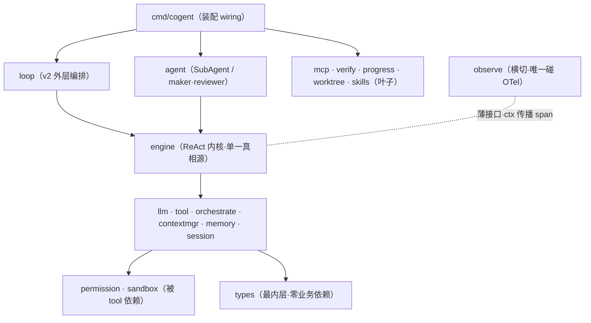

# Cogent · 工程打磨与加固规格 — OPTIMIZE_SPEC

> 版本 0.1（v1+v2 收官后的打磨增量）｜代号 `cogent-polish`｜主语言 **Golang**
> 定位：在 `cogent` 已 100% 完成 [`DEV_SPEC.md`](DEV_SPEC.md)（v1，22/22）与 [`LOOP_SPEC.md`](LOOP_SPEC.md)（v2，23/23）的基础上，**以 Claude Code 为标杆**，从**可靠性 / 安全性 / 可观测性 / 可读性**四个维度做最后一轮工程加固。
> 性质：**纯设计/审查产出，未改动任何 `.go` 代码、不新增功能**——只盘点现状、定位差距、给出分级改进排期。

## 目录

1. [定位与范围](#1-定位与范围)
2. [可靠性 Reliability](#2-可靠性-reliability)
3. [安全性 Security](#3-安全性-security)
4. [可观测性 Observability](#4-可观测性-observability)
5. [架构与数据流 Architecture & Data Flow](#5-架构与数据流-architecture--data-flow)
6. [可读性 Readability](#6-可读性-readability)
7. [改进项总览表](#7-改进项总览表)
8. [分级排期](#8-分级排期)
9. [文档状态声明](#9-文档状态声明)

---

## 1. 定位与范围

### 1.1 这是什么

cogent 已是一台功能完整的自主编码 Agent Runtime：v1 交付了 ReAct 内核、并发调度、上下文工程、安全三道防线、会话恢复、MCP、SubAgent、OpenTelemetry 可观测；v2 在其上叠加了目标循环、maker/reviewer、Automations、worktree、Skills。**功能层面已无大缺口**。

本文档不再加功能，而是回答一个更工程化的问题：**当这套系统从「能跑通 demo」走向「敢长期无人值守地跑」，还差哪些打磨？** 以 Claude Code 在生产环境的工程取舍为锚点，逐维度审查并给出可落地的加固清单。

### 1.2 评估维度

四个核心维度 + 一个**应用户要求补充**的架构维度：

| 维度 | 一句话拷问 | 对应章节 |
| --- | --- | --- |
| 可靠性 Reliability | 瞬时故障（限流/抖动/panic）来临时，系统是优雅降级还是直接崩？ | §2 |
| 安全性 Security | §7 威胁模型的每一条，代码是否真的兜住了？还有哪些理论缺口？ | §3 |
| 可观测性 Observability | §8 自己承诺的 span 字段与指标，代码追平了多少？ | §4 |
| 架构与数据流 Architecture（补充） | 整体架构/代码/数据流是优秀，还是凌乱、需要重新编排？ | §5 |
| 可读性 Readability | 代码/文档/命名是否经得起他人接手与 code review 逐行追问？ | §6 |

> 核心四维度（可靠性/安全性/可观测性/可读性）为本轮主线；**架构与数据流**为应用户要求增补的第 5 维度。其余如性能、可测试性、成本治理本轮不展开。

### 1.3 对标口径（中度对标）

以 DEV_SPEC 文中已标注的「蓝本」机制（`query.ts` 主循环、`partitionToolCalls` 调度、`autoCompact.ts` 压缩、`sessionStorage.ts` 恢复、`TOOL_DEFAULTS` fail-closed、sandbox 执行链等）为参照，每个差距点出「Claude Code 大致怎么做 → cogent 现状 → 差距/改进」，但**不深挖** `claude-code-analysis/` 源码，重心放在 cogent 自身代码的真实状态。

### 1.4 评级约定

- **优先级**：`P0`（高价值低风险，应优先）｜`P1`（明确收益，建议排入）｜`P2`（锦上添花/取舍说明）。
- **工作量**：`S`（≤0.5 天）｜`M`（0.5~2 天）｜`L`（>2 天）。
- **正面标注**：现状已达标处明确标 **✓ 已达标**，不为凑数硬造问题。

### 1.5 不可破坏的约束（贯穿所有改进）

所有改进建议必须守住 v1/v2 既有不变量，不得为了加固而破坏架构：

- **依赖只能向内**（DEV_SPEC §4.4）：不得让 `engine` 反向依赖 `loop`，不得让内核 import OTel（只有 `observe` 碰 OTel）。
- **fail-closed**：任何新增旋钮的默认值都应是最安全/最保守的一侧。
- **function calling 配对完整**：任何对消息历史的改动都不得产生悬空 `tool_use`/孤立 `tool_result`。
- **可观测零侵入**：埋点关闭时为 no-op，业务代码无 `if` 分支污染。
- **error 末位且必处理、禁 panic 作常规错误流、导出符号带注释、函数 <80 行、嵌套 <4 层、参数 ≤5**。

---

## 2. 可靠性 Reliability

### 2.1 标杆做法

生产级 coding agent 长链路、多轮、强依赖外部 LLM API，**瞬时故障是常态而非异常**：429 限流、网络抖动、5xx、流式中途断开、单个工具实现 panic。Claude Code 的内核对这些做了系统性兜底——可重试错误带退避重试、工具错误规范化为 `tool_result` 回流让模型自我修正而非崩溃、整条链路受 `ctx` 取消统一收口。可靠性的核心命题是：**任何单点抖动都不应升级为整任务/整进程的失败**。

### 2.2 cogent 现状盘点

**✓ 已达标（正面案例，应保留）**：

- **错误规范化回流**：工具执行失败规范化为 `ToolResult{IsError:true}` 回流给模型，不中断主循环（`internal/tool` 各工具 + `internal/engine/exec.go`）；只有内核级不可恢复错误才经 `EventError` 终止（`engine.step` 内 `streamAssistant` 出错路径，`engine.go:200`）。
- **压缩失败不丢历史**：`maybeCompact`（`engine.go:220`）压缩失败仅 `slog.Warn` 并保留原历史，熔断后 `ShouldCompact` 恒 false 自然跳过——这是教科书级的优雅降级。
- **失控护栏齐全**：内层 `maxSteps`（`engine.go:26` 默认 16）+ 单条命令超时（`sandbox.defaultExecTimeout` 30s）+ 压缩熔断；外层 `loop.Budget` 三重护栏（轮数/成本/墙钟，`loop/loop.go`）。内外两层正交叠加。
- **ctx 取消传播完整**：`emit`/`emitEvent`（`llm/client.go:138`、`engine.go:340`）均 `select { case <-ctx.Done() }`，取消时 channel 正常 close；`goleak` 已在测试中验证无泄漏。

### 2.3 差距与改进项

#### R1【P0 · M】LLM 流式调用无重试与退避

- **现状**：`internal/llm/client.go` 的 `Stream`（L78）对 `CreateChatCompletionStream` 的错误直接 `return nil, fmt.Errorf("create stream: %w", err)`；流中错误经 `pump`（L95）直接 `emit(Delta{Err})` 终止本轮。全仓检索 `retry|backoff|429` **零命中**——意味着一次 429 限流或瞬时网络抖动就会让当前 ReAct 步进失败。
- **标杆**：对幂等的读类 API 调用做指数退避 + jitter 重试是后端基本功；LLM 的 429/503/网络超时正是典型可重试错误。
- **改进方案（草案）**：在 `llm` 包内引入可注入的 `RetryPolicy`，仅对**可重试错误**（HTTP 429/5xx、`net` 超时、连接 reset）做指数退避重试，**区分 `ctx.Canceled`/`DeadlineExceeded` 不重试**（用户取消应立即收手）：

  ```go
  // RetryPolicy 配置可重试错误的退避策略；零值表示不重试（向后兼容）。
  type RetryPolicy struct {
  	MaxAttempts int           // 最大尝试次数（含首次）；<=1 即不重试
  	BaseDelay   time.Duration // 首次退避基准
  	MaxDelay    time.Duration // 退避上限
  }

  // isRetryable 仅对限流/服务端/网络瞬时错误返回 true；ctx 取消与 4xx（除 429）不重试。
  func isRetryable(err error) bool
  ```

  仅对「建立流」阶段重试（流已开始吐 token 后重试会破坏增量语义，应放弃本次重试转为整轮失败由上层 `maxSteps` 兜底）。重试次数/退避作为指标上抛（见 §4 O3）。
- **风险/边界**：重试会放大成本与延迟，须受 `ctx` 墙钟约束；默认 `MaxAttempts=1`（不重试）保持向后兼容，由 cmd 层按 env 显式开启。
- **不变量衔接**：纯加在 `llm` 包内部，接口 `Client.Stream` 签名不变，内核无感。

#### R2【P0 · M】内核 goroutine 无 panic 恢复，单点 panic 击穿整进程

- **现状**：全仓检索 `recover()` **零命中**。而内核在多处启动 goroutine：`engine.Run`/`Resume`（`engine.go:146`/`176`）、`llm.Stream` 的 `pump`（`client.go:84`）、`orchestrate.Run` 的并发批 `g.Go`（见 §2.3 R3）、`agent.Spawn`（`spawner.go`）。**任意一处 panic（如某工具对畸形输入 `nil` 解引用、JSON 断言失败）都会击穿整个进程**——对一个要无人值守长跑的 Loop 守护进程而言，这是最危险的可靠性缺口。
- **标杆**：长跑服务在每个 goroutine 边界设 `defer recover()`，把 panic 降级为该请求/该任务的错误，绝不让其逃逸到 runtime 终止进程。
- **改进方案（草案）**：在内核 goroutine 的 `defer close(out)` 同层加一道 recover，把 panic 转为 `EventError`（内核循环）或 `ToolResult{IsError}`（工具执行），并 `span.RecordError`：

  ```go
  // safeGo 在 goroutine 边界把 panic 降级为 onPanic 回调（转 EventError / ToolResult），
  // 避免单点 panic 击穿整进程；recover 仅在 defer 中、不滥用于常规错误流。
  func safeGo(onPanic func(v any), fn func()) {
  	defer func() {
  		if v := recover(); v != nil {
  			onPanic(v)
  		}
  	}()
  	fn()
  }
  ```

  注意：`recover` 返回 `interface{}`，**不假设其为 error、不命名为 `err`**（遵循用户规范）；panic 转换的错误信息应脱敏后入日志/trace。
- **风险/边界**：recover 只用于 goroutine 顶层兜底，**不得**用它替代正常 error 流（用户规范明确禁止 panic 作常规错误处理）；恢复后应让对应任务以失败收尾，而非「吞掉继续」。
- **不变量衔接**：仅在既有 goroutine 入口加 defer，不改控制流主干。

#### R3【P1 · S】并发批中单个工具 panic 会传播

- **现状**：`internal/orchestrate/orchestrate.go` 的并发批用 `errgroup` 的 `g.Go` 执行 `runOne`；若某工具实现 panic，会逃逸出 goroutine 击穿进程（与 R2 同源，但发生在工具执行面）。
- **改进方案**：在 `runOne`（或其外层 `g.Go` 闭包）套 R2 的 `safeGo`/recover，把工具 panic 转为 `ToolResult{IsError:true, Content:"tool panicked: ..."}`，让模型把它当普通工具失败自我修正。
- **优先级理由**：工具是「最不可信代码」（含 MCP 外部工具），panic 面最大；但改动局部、风险低，可与 R2 一并落地。

#### R4【P1 · S】LLM 单次调用缺独立超时上限

- **现状**：`streamAssistant`（`engine.go:263`）把顶层 `ctx` 直接传给 `llm.Stream`，未对单次 LLM 调用施加独立 `context.WithTimeout`。若模型「首 token 迟迟不来」又无墙钟约束（单次 `run` 无 Budget），该步可能长时间挂起。
- **标杆**：每次外部调用都应有自己的超时上限，而非只依赖全局取消。
- **改进方案**：在 `streamAssistant` 内对每次 `llm.Stream` 调用包 `ctx, cancel := context.WithTimeout(ctx, llmCallTimeout)`（可配，默认如 120s），`defer cancel()`；超时即本轮失败，由 `maxSteps`/上层兜底。
- **不变量衔接**：复用同一 `ctx`，超时与取消共用一条管线（DEV_SPEC §4.3）。

#### R5【P2 · S】resume 边界场景的健壮性说明

- **现状（已较稳）**：`scanEvents`（`session/store.go:118`）已对空行/坏行容错跳过、按 UUID 去重保序、`bufio` 缓冲上限 8MiB 容忍超长工具结果；`filterUnresolvedToolUses` 剥离悬空 `tool_use`。
- **可补强**：① 进程在 `Append` 写到一半崩溃可能产生「半行」JSON，当前靠 `json.Unmarshal` 失败跳过该行兜住了，但**该半行之后的完整行仍能恢复**这一点值得在测试中显式固化（边界用例）；② 超大 transcript（数十万行）一次性 `scanEvents` 进内存的内存上界，可在文档标注「v1 假设单会话规模可控」的边界。
- **优先级理由**：当前实现已足够稳，此项主要是**把隐含的健壮性显式化**（补边界测试 + 文档边界声明），非缺陷修复。

### 2.4 与架构不变量的衔接

R1~R5 全部为**内核内部加固**：不改任何对外接口签名（`Client.Stream`、`Engine.Run` 不变），不改依赖方向，不破坏 ctx 一条到底与 function calling 配对。R1/R4 的旋钮默认值取「不重试/沿用全局超时」以保持向后兼容，由 cmd 层显式开启——符合 fail-closed 与「能力显式声明」原则。

---

## 3. 安全性 Security

### 3.1 标杆做法

Claude Code 的安全观是「sandbox 不是外围插件，而是执行链的一部分」：路径强制根目录约束、控制面（`.claude/`、settings）denyWrite、网络 allowlist、危险命令拦截、密钥不入库不入日志。核心是**不依赖模型善意的确定性防线**。cogent 的 DEV_SPEC §7 已建立完整威胁模型（T1~T8）与三道防线，本节逐条复核**代码落地度**，并找出理论缺口。

### 3.2 cogent 现状盘点（对照 §7 威胁模型逐条）

| 威胁 | 防线代码 | 落地度 |
| --- | --- | --- |
| T1 路径穿越 | `sandbox.ValidatePath`（`path.go:31`）`filepath.Clean`+前缀校验 | ✓ 基本达标（symlink 见 S1） |
| T2 危险命令 | `IsDangerousCommand`+`splitComposite`+fork bomb+`isPipeToShell`（`path.go:69`） | ✓ 达标（清单可扩，见 S5） |
| T3 Prompt Injection | HITL `ask`（`tool/guard.go`）+ 控制面写禁止 | ✓ 达标（机制兜底，非靠模型） |
| T4 MCP 劫持 | `mcp__` 命名隔离 + 内建优先 + `tool.Defaults` fail-closed（`mcp/remote_tool.go`） | ✓ 达标 |
| T5 控制面投毒 | `IsControlPlaneWrite`（`path.go:48`）禁写 `.cogent`/`.git` | ✓ 达标 |
| T6 密钥泄露 | 仅 env（`llm.New` fail-fast）+ `redactSecrets`（`session/store.go:171`）+ `.gitignore` | ⚠️ 脱敏覆盖面可扩（S2）+ trace 面未覆盖（S3） |
| T7 SSRF | v1 未内置 WebFetch，无网络工具面 | ✓ 达标（无攻击面） |
| T8 资源滥用 | `maxSteps`+`Budget`+超时+熔断 | ✓ 达标 |

### 3.3 差距与改进项

#### S1【P1 · M】`ValidatePath` 未解析符号链接，存在 symlink 越界理论缺口

- **现状**：`ValidatePath`（`sandbox/path.go:31`）走 `filepath.Clean` + 字符串前缀（`strings.HasPrefix(abs, root+sep)`）校验。全仓检索 `EvalSymlinks` **零命中**。这意味着：若工作区内存在一个指向区外的符号链接（如攻击者诱导创建 `link -> /etc/passwd`，或仓库本身带恶意 symlink），后续对 `link` 的读写在字符串层面仍落在 `root` 内、通过校验，但**实际 I/O 会穿透到工作区之外**。DEV_SPEC §9.2.1 已把 symlink 列为测试项，但代码层面尚未落地解析。
- **标杆**：路径校验必须在**解析软链接之后**判断真实落点是否越界。
- **改进方案（草案）**：

  ```go
  // ValidatePath 在 Clean+前缀校验之上，对已存在路径解析符号链接后再次校验真实落点；
  // 目标不存在时解析其最近的已存在父目录（防止经 symlink 父目录写出区外）。
  func ValidatePath(workRoot, target string) (string, error) {
  	// ... 现有 Clean + 前缀校验 ...
  	resolved, err := filepath.EvalSymlinks(abs)
  	if errors.Is(err, os.ErrNotExist) {
  		resolved = resolveExistingParent(abs) // 解析最近存在的父目录
  	} else if err != nil {
  		return "", fmt.Errorf("eval symlinks: %w", err)
  	}
  	if !withinRoot(resolved, root) {
  		return "", ErrPathEscape
  	}
  	return abs, nil
  }
  ```

  注意 `workRoot` 本身也应先 `EvalSymlinks`（如 macOS `/tmp` → `/private/tmp`），否则解析后的真实路径与未解析的 root 前缀比对会误判。
- **风险/边界**：`EvalSymlinks` 有额外 `stat` 开销与「目标不存在」的处理复杂度（写新文件场景），需用解析父目录的方式兜住；务必补 symlink 越界 + 合法子路径的表驱动测试（呼应 §9.2.1）。
- **不变量衔接**：`ValidatePath` 签名不变，所有文件工具透明受益。

#### S2【P1 · S】密钥脱敏正则覆盖面有限

- **现状**：`redactSecrets`（`session/store.go:171`）覆盖 `sk-` 前缀令牌 + JSON 字段 `api_key|apikey|secret|token|password`。这覆盖了 DeepSeek/OpenAI key 与常见字段，但**漏掉**了：GitHub PAT（`ghp_`/`gho_`/`ghu_`/`ghs_`）、AWS Access Key（`AKIA[0-9A-Z]{16}`）、Slack（`xox[baprs]-`）、`Bearer <token>` 头、PEM 私钥块（`-----BEGIN ... PRIVATE KEY-----`）、JWT（`eyJ...`）。当模型读到含这类密钥的文件并回流时，可能落入 transcript。
- **改进方案（草案）**：把脱敏逻辑**提取为独立 `internal/secret` 叶子包**（仅依赖标准库），集中维护正则集，供 `session`（落盘）与 `observe`（入 trace，见 S3）**共用同一套规则**，避免两处脱敏不一致：

  ```go
  // Package secret 集中维护敏感信息脱敏规则，供 session 落盘与 observe 入 trace 共用。
  package secret

  // Redact 把 b 中命中的密钥/令牌替换为 [REDACTED]，规则覆盖常见云厂商与凭据格式。
  func Redact(b []byte) []byte
  ```

- **风险/边界**：正则过宽会误伤正常文本（如 `token` 字段里的业务 token），需以「宁可少脱敏业务串、必脱敏高熵凭据」为度；附测试样本集。
- **优先级理由**：收益明确、改动小，且为 S3 的前置（统一脱敏入口）。

#### S3【P1 · M】span attribute 入 trace 前无脱敏约定

- **现状**：`observe.otelTracer.Start`（`otel.go:106`）直接 `span.SetAttributes(toKeyValues(attrs)...)` 写入原始值。当前 span attr 多为低敏字段（`llm.model`、`tool.name`、`step.index`），**风险尚低**；但 DEV_SPEC §8.3 明确承诺 `cogent.session` 要写 `task`（脱敏后摘要）、§8.3 末注「敏感字段（task 原文、文件内容、命令明文）落 span 前先脱敏」。一旦 §4（可观测）补齐这些字段（如 O1 给 session span 写 task、给 tool.call 写 input），**就会把敏感内容写进 trace 文件（`data/traces/*.jsonl`）**——这是与 S2 同源的密钥/隐私泄露面，只是出口不同。
- **改进方案**：① 复用 S2 的 `secret.Redact` 建立「**任何写入 span 的字符串值，入 trace 前先过 redact**」的强约定；② 对 `task`/`file content`/`command` 这类高敏字段只写**截断摘要**而非原文；③ 可在 `observe` 内对字符串型 `Attr` 统一过一道 `secret.Redact`（集中拦截，避免每个埋点处遗漏）。
- **不变量衔接**：脱敏在 `observe` 包内（唯一碰 OTel 的包）实现，内核埋点处无感；与「可观测零侵入」一致。
- **优先级理由**：当前实际风险低（敏感字段尚未入 trace），但它是 §4 补字段工作的**安全前置**——必须先立脱敏约定，再补字段，否则补字段即引入泄露。

#### S4【P2 · S】沙箱跨平台 OS 级隔离的「不做及理由」需显式化

- **现状**：`internal/sandbox` 采用**策略型隔离**——受限环境变量（`restrictedEnv`，`sandbox.go:132`，精简 PATH、HOME 指向 WorkRoot、不透传宿主密钥）+ `bash -c` 在 WorkRoot 内执行 + 危险命令确定性拦截 + bare-repo 逃逸产物清理（`scrubBareGitRepoFiles`）。**无** OS 级强隔离（Linux `landlock`/`seccomp`、`bwrap`）。
- **改进方案**：这是**合理的工程取舍**（跨平台成本高、与「单二进制本地工具」定位匹配），但应在文档**显式声明边界**：「v1 不依赖平台特定隔离，安全性建立在策略型隔离 + 路径/命令确定性校验 + 执行后清理；进阶可在 Linux 接 `landlock`（限制 fs 访问）/`seccomp`（限制 syscall）作为可选加固层」。同时明确**残余风险**：受限 env 不阻止进程发起网络连接（无 SSRF 工具面时风险低，但需记录）。
- **优先级理由**：非缺陷，而是**把已有取舍写清楚**，让安全姿态可审计、可解释。

#### S5【P2 · S】危险命令清单可保守扩充

- **现状**：`dangerousFragments`（`path.go:21`）覆盖 `rm -rf /`、`rm -rf /*`、`rm -rf ~`、`mkfs`、`dd if=`、`> /dev/sd`，加上 fork bomb 与 pipe-to-shell。
- **可扩**（保守、低误伤）：`chmod -R 777 /`、`chown -R ... /`、`> /dev/sda`（已部分）、`base64 -d ... | sh`（编码绕过 pipe-to-shell 检测）、`:(){`（已覆盖 fork bomb）。
- **风险/边界**：每加一条都要权衡误拦（如开发者合法的 `rm -rf ./build`），**绝不能把合法工作区内操作拦死**；危险拦截是「保守宁误拦」与「不阻碍正常工作」的平衡，扩充需配套测试。建议保持当前「子串保守匹配」策略，仅补明确高危项。

#### S6【P2 · S】`Enabled=false` 沙箱继承宿主环境的取舍需文档化

- **现状**：`ScriptVerifier`（`verify`）与 `gitDiscarder`/worktree（`cmd` 层）刻意用 `sandbox.Config{Enabled:false}`，使命令继承宿主 PATH 以调用 `go`/`git` 工具链（受限 env 的精简 PATH 无这些工具）。`ShouldSandbox`（`sandbox.go:70`）在 `!Enabled` 时返回 false、跳过受限 env，但**危险命令拦截（`isDangerous`）仍生效**（`Exec` 开头无条件检查）。
- **改进方案**：文档化这一边界——「验收脚本/git 操作是**开发者可信控制面**（非模型直接发起），故继承宿主 PATH；即便如此，危险命令拦截与 WorkRoot 约束仍生效，构成纵深」。这解释了「为什么这里 Enabled=false 不是安全漏洞」。
- **优先级理由**：纯文档澄清，消除「为何此处关沙箱」的疑虑。

### 3.4 与架构不变量的衔接

S1（symlink）在 `sandbox.ValidatePath` 内加固，签名不变；S2（脱敏包）新增 `internal/secret` 叶子包仅依赖标准库，被 `session`/`observe` 复用，不引入循环依赖；S3（trace 脱敏）在 `observe` 包内拦截，守「只有 observe 碰 OTel」；S4~S6 为文档化取舍，零代码改动。全部符合 fail-closed 与纵深防御。

---

## 4. 可观测性 Observability

### 4.1 标杆做法

Agent 长链路、多轮、并发，黑盒化后无法回答「慢/贵/错在哪」。DEV_SPEC §8 已自我定义了完整的可观测蓝图：一棵 `cogent.session → react.step → llm.stream / tool.call / ...` 的 span 树（§8.2/§8.3 约定了每个 span 应带的 attribute），加一组 §8.7 的指标。**本章的对标对象就是 cogent 自己许下的承诺**——盘点代码追平了多少、还差多少。

### 4.2 cogent 现状盘点

**✓ 已达标（基础设施扎实）**：

- **Exporter 工厂完备**：`newExporterSet`（`observe/exporter.go:38`）分派 `file`/`otlp`/`stdout`/`none`，未知值明确报错不静默回落；file 后端 `data/traces/traces-<ts>.jsonl`、目录 `0o700`/文件 `0o600`、`filepath.Base` 清洗防穿越。
- **日志与 trace 对齐**：`traceHandler.Handle`（`observe/slog.go:28`）从 ctx 的 `SpanContext` 注入 `trace_id`/`span_id` 到 slog，`WithAttrs`/`WithGroup` 重包保持注入不丢——日志可与 span 互查。
- **no-op 零开销降级**：`New`（`observe/observe.go`）在 `!Enabled` 或 `Exporter=="none"` 时返回 `noopProvider`，`Start` 原样返回 ctx + 空 `EndFunc`，业务无 `if` 分支。
- **出错统一红色高亮**：`otelTracer.Start` 的 `EndFunc`（`otel.go:111`）在 `err != nil` 时统一 `RecordError`+`SetStatus(codes.Error)`。
- **span 树骨架在位**：`react.step`/`llm.stream`/`ctx.compact`/`tool.call`/`tool.batch`/`permission.check`/`sandbox.exec`/`mcp.call`/`agent.spawn`/`loop.run`/`loop.iteration`/`loop.daemon`/`goal.verify` 共 13+ 个 span 名均已埋点（经全仓 `tracer.Start` 核验）。

**已落地指标**（经全仓 `meter.Count/Record` 核验）：`cogent.react.steps`（`engine.go:191`）、`cogent.tokens`（`engine.go:297`）、`cogent.tool.calls`（带 `tool.name`/`is_error` 标签，`exec.go:36`）、外加 v2 的 `cogent.loop.iterations`/`outcome`/`cost_usd`/`verify.passed`/`review.verdict`。

### 4.3 差距与改进项

#### O1【P1 · M】缺 `cogent.session` 根 span，单次任务无归因根

- **现状**：全仓检索 **无** `tracer.Start(..., "cogent.session", ...)`。DEV_SPEC §8.2/§8.3 把 `cogent.session` 定为根 span（携带 `session.id`/`task`/`model`/`outcome`/`total_steps`/`total_tokens`/`cost_usd`）。当前 `engine.Run` 直接从 `react.step` 开 span——单次 `cogent run`（不走 loop）的 trace **没有根节点**，无法在一个 span 上汇总「这次任务共几轮、花了多少 token、最终成败」。v2 的 `loop.run` 虽是更外层根，但仅在走目标循环时存在。
- **改进方案（草案）**：在 `engine.Run`/`Resume` 的 goroutine 入口开 `cogent.session` span（贯穿整轮 ReAct），结束时补 `outcome`（done/cancelled/error）、`total_steps`、`total_tokens` 等汇总属性；`react.step` 自然挂为其子 span。`task` 字段须经脱敏摘要写入（见 S3）。
- **不变量衔接**：复用 ctx 传播，`react.step` 等子 span 自动挂接；no-op 时零开销。

#### O2【P1 · M】`llm.stream` span 缺 token/延迟/finish_reason 字段

- **现状**：`streamAssistant`（`engine.go:267`）的 `llm.stream` span 仅设 `llm.model` 一个属性。DEV_SPEC §8.3 承诺 `llm.prompt_tokens`/`llm.completion_tokens`/`llm.ttft_ms`（首 token 延迟）/`llm.finish_reason`，且 §6.8 注释（L1027）明文「span 结束时补 prompt_tokens/completion_tokens/ttft_ms」——但 `end(err)` 未补任何属性。token 信息当前只进了 `cogent.tokens` 计数器，**未落到 span**，导致无法在火焰图上按轮看「哪一轮的 LLM 调用贵/慢」。
- **改进方案（草案）**：在 `streamAssistant` 内记录首个 token 到达时间（`ttft`）、累积 `Usage`、捕获 `finish_reason`，在 span 结束前写入。这需要 **`observe.Tracer` 接口的小扩展**——当前 `EndFunc` 只收 `err`，无法在结束时补 attr。两种方案：
  - 方案 A（推荐）：`Start` 额外返回一个可 `SetAttrs` 的句柄，或把 `EndFunc` 改为 `func(err error, attrs ...Attr)`，使调用点能在结束时补属性。
  - 方案 B：保持接口不变，让 `streamAssistant` 用一个内部聚合结构在 `defer end(err)` 前把 attr 通过新增的 `tracer.SetAttrs(ctx, ...)` 写入当前 span。
- **风险/边界**：这是**唯一涉及 `observe` 导出接口微调**的改进项，需保证 OTel 类型仍不外泄、no-op 仍零开销；改完所有 span（如 O1 的汇总属性、O4）都能复用该能力。
- **优先级理由**：可观测价值高（成本/延迟归因是 §8.1 的核心卖点），但牵动接口，需谨慎设计。

#### O3【P1 · M】§8.7 承诺的多项指标未落地

- **现状**：§8.7 列出的指标中，`cogent.compact.count`/`cogent.compact.circuit_open`、`cogent.llm.ttft`、`cogent.tool.duration`、`cogent.step.duration` **均未落地**（全仓无对应 `meter` 调用）。
- **改进方案**：
  - `maybeCompact`（`engine.go:220`）：压缩触发处 `meter.Count("cogent.compact.count")`，熔断处 `meter.Count("cogent.compact.circuit_open")`。
  - `streamAssistant`：记首 token 延迟 `meter.Record("cogent.llm.ttft", ttftMs)`。
  - `exec.go runOne`：工具执行耗时 `meter.Record("cogent.tool.duration", ms, Attr{tool.name})`。
  - `step`：单轮耗时 `meter.Record("cogent.step.duration", ms)`。
- **不变量衔接**：纯加 `meter` 调用，no-op 时零开销；与 O2 的 ttft 采集可共享。

#### O4【P2 · S】多个 span 的 attribute 稀疏

- **现状**：`ctx.compact`（`engine.go:231`）、`agent.spawn`（`spawner.go:57`）、`loop.daemon`（`daemon.go:35`）、`goal.verify`（`orchestrator.go:163`）**无 attr**；`react.step` 仅 `step.index`（缺 §8.3 承诺的 `tool_use.count`、`step.outcome`）。
- **改进方案**：按 §8.3 表逐项补：`ctx.compact` 补 `compact.tokens_before/after`/`circuit_open`；`react.step` 补 `tool_use.count`/`step.outcome`；`goal.verify` 补 `verify.kind`/`verify.passed`/`exit_code`；`agent.maker`/`agent.reviewer` 补 `agent.role`/`review.approved`。可与 O1/O2 一并落地（同样依赖 O2 的「结束时补 attr」能力）。

#### O5【P2 · S】`worktree.*` span 缺失

- **现状**：`internal/worktree` 的 `Create`/`Merge`/`Discard` **无任何埋点**。LOOP_SPEC §6.1 承诺了 `worktree.create/merge/discard` span（带 `worktree.branch`/`merge.conflict`）。
- **改进方案**：在 `worktree.Manager` 各方法开对应 span（需给 `worktree` 注入 `observe.Tracer`，或在 cmd 层 `worktreePipeline` 调用处埋点以避免叶子包依赖 observe——后者更守依赖方向）。
- **优先级理由**：仅在 `--worktree` 路径生效，影响面小。

#### O6【P1 · —】脱敏一致性（与 §3 S3 同根，此处登记可观测视角）

- 见 §3.3 S3：补 O1（session 写 task）、O4（可能写 input/command）等字段时，**必须先建立 span attr 入 trace 前过 `secret.Redact` 的约定**，否则补字段即引入泄露。此项是 O1/O4 的安全前置，不重复展开。

### 4.4 与架构不变量的衔接

O1/O3/O4/O5 为纯埋点增补，no-op 时零开销、不污染内核控制流；唯一需注意的是 **O2 涉及 `observe.Tracer` 接口的最小扩展**（结束时补 attr），实现时须守住「OTel 类型不外泄、内核对 OTel 无感」——这是本章唯一的接口级改动，应集中评审。所有指标/属性写入复用既有 ctx span 传播，不新增管线。

---

## 5. 架构与数据流 Architecture & Data Flow

> 本章为**应用户要求补充的第 5 个评估维度**，直接回答：cogent 当前整体架构、代码组织、数据流是**优秀**，还是**凌乱、需要重新编排**？

### 5.1 标杆做法

Claude Code 的架构可概括为「**单一执行内核 + 自上而下分层 + 单向数据流 + 横切可观测**」：`query.ts` 是唯一持有会话状态的真相源、UI 仅消费事件；工具即协议（统一接口 + fail-closed 默认）；`ctx` 串起取消与传播。一套**优秀**的 Agent 架构判据可归纳为五条：① 依赖单向、无环；② 状态单一真相源；③ 事件单向流动、无反向回调；④ 扩展点接口化、可替换可测试；⑤ 横切关注（可观测）不侵入业务分支。

### 5.2 cogent 现状盘点

**结论先行：架构优秀、数据流清晰，无需重新编排。** 这是项目的**强项维度**（与可读性同属「已达标」），下列改进项全为 P2 取舍说明，无一指向重构。每条均有可复现证据。

#### ✓ 依赖方向向内、无环（核心证据，`go list` 权威核实）

`go list -deps ./internal/engine` 显示 `engine` 仅依赖 `contextmgr / llm / memory / observe / session / tool / types`，**零反向依赖** `loop / agent / mcp / cmd`；`engine` 被 `agent`、`loop` 依赖（方向正确）；`loop` 包**未** import `agent`（经 cmd 的 `pipelineAdapter` 桥接）。与 DEV_SPEC §4.4、LOOP_SPEC §3.2 的声明**完全一致**——文档画的依赖图，代码真的做到了。



> 关键：箭头**只向内/向下**、无任何回指；`engine` 永不感知 `loop`/`agent`，故 v1 内核可独立编译/测试，v2 是可裁剪的外挂层。

#### ✓ 数据流四不变量严格成立

| 不变量 | 代码体现 |
| --- | --- |
| 单一真相源 | 业务状态只在 `engine.msgs`（`engine.go:137`）；UI/loop 仅消费 channel，不持有逻辑 |
| 事件单向上抛 | `<-chan types.StreamEvent`（内层）与 `<-chan LoopEvent`（外层）单向流出，无反向回调 |
| ctx 一条到底 | 同一 `ctx` 贯穿取消 + 超时 + trace（`emit`/`emitEvent` 均 `select <-ctx.Done()`） |
| 工具池运行期只读 | `tool.Pool` 启动期装配、运行期不可变，免并发读写注册表 |

#### ✓ 包职责单一、文件规模健康

`internal/` 下每个包一个清晰职责，大包按职责拆分（`engine` → engine/exec/session_event；`tool` → 每工具一文件 + guard + task）。**最大非测试文件 `cmd/cogent/commands.go` 仅 299 行**，其余均 <215 行（`review.go` 208、`sandbox.go` 207、`compact.go` 205…），全部远低于用户规范的 800 行/文件、80 行/函数上限——**无超大文件、无上帝对象**。

#### ✓ 抽象与解耦到位

- **依赖倒置**：`engine.Deps`/`loop.Deps` 注入全部依赖，便于测试替身。
- **接口即协议**：`Tool`/`Client`/`Sandbox`/`Store`/`Tracer` 皆接口，实现可换。
- **消费侧最小接口破环**：`engineRunner`/`Spawner`/`Pipeline`/`makerReviewerRunner` 在消费侧定义最小接口 + 适配器桥接，使 `loop` 不必 import `agent`——比文档要求更克制的解耦。
- **v2 叠加哲学验证成功**：`engine/tool/orchestrate/sandbox` 一行未改，v2 全部能力以叶子包 + 外层编排实现。

### 5.3 差距与改进项（均 P2，无一需要重排）

#### A1【P2 · M】cmd 层 wiring 复杂度随 v2 增长

- **现状**：装配逻辑集中在 cmd 层，`commands.go`（299）+ `review.go`（208）+ `goal.go`/`loop.go`/`skills.go`，含多个 builder（`buildEngine`/`buildOrchestrator`/`buildMakerReviewer`/`buildToolPool`/`buildMCPManager`/`buildVerifier`）。随功能增多，wiring 开始变重。
- **判定**：这是「**装配复杂度**」而非「**架构凌乱**」——业务逻辑仍干净地留在 `internal/`，cmd 只做组装，符合 Go「wiring 集中在 main/cmd」的惯例。当前规模（<300 行）**尚不构成问题**。
- **可选优化（非必需）**：若 wiring 继续膨胀，可抽统一装配结构体收敛 builder，或引入 `google/wire` 做编译期 DI。**当前不建议动**——引入 wire 会增依赖、降直观性，得不偿失。

#### A2【P2 · S】loop↔agent 经 cmd 适配器桥接（有意识的权衡）

- **现状**：LOOP_SPEC §3.2 本允许 `loop → agent`，但实现选择「`loop` 定义消费侧最小 `Pipeline` 接口 + cmd 层 `pipelineAdapter` 投影 `agent.MakerReviewer`」，调用链多一层适配，**略绕**。
- **判定**：这是**换取更彻底解耦**的有意识权衡（`loop` 对 `agent` 零编译依赖，与 `engineRunner`/`Spawner` 惯例一致），不是设计失误。
- **改进方案**：仅需在文档/注释点明此选择动机，**代码不改**。

#### A3【P2 · S】内核 goroutine 直接 `go func` 启动、无统一池化

- **现状**：`engine.Run`/`Resume`、`llm.pump`、`orchestrate` 并发批、`agent.Spawn` 均直接 `go func`，无统一 worker 池或生命周期管理抽象。
- **判定**：当前由「`ctx` 取消 + channel close 责任明确」管理已**足够清晰**，`goleak` 验证无泄漏——引入 goroutine 池属过度设计。
- **改进方案**：仅在文档点明「未引入 goroutine 池是刻意的轻量取舍」。注：此项与 §2.3 R2（给 goroutine 加 panic 恢复）正交——R2 是加 `recover` 兜底，与是否池化无关。

### 5.4 与架构不变量的衔接

A1~A3 即便全部落地也**不改变依赖方向、不破坏四大数据流不变量**——它们是「在已优秀的架构上是否要再抽象一层」的风格性取舍，而非「架构有缺陷需修正」。**当前架构已处于「可演进而无需重写」的健康态**：新增能力走叶子包 + 外层叠加即可，这正是好架构的标志。

---

## 6. 可读性 Readability

### 6.1 标杆做法

可读性的标尺是「他人能否快速接手、reviewer 能否逐行追问而不卡壳」：包职责内聚、导出符号有 godoc、命名一致、函数短、错误信息合规、文档与代码同步。

### 6.2 cogent 现状盘点

**✓ 整体优秀（本维度为强项，多数项已达标）**：

- **包注释齐全**：抽样 `engine`/`llm`/`sandbox`/`session`/`observe` 等包顶部均有 `// Package xxx ...` 文档注释，且多带 DEV_SPEC 章节引用（如 `session/store.go` 注「DEV_SPEC §6.5」），便于代码↔设计互查。
- **导出符号 godoc 普遍覆盖**：抽样接口/结构体/函数（`Engine`/`Tool`/`Client`/`Sandbox`/`Store` 及其方法）均带注释，格式遵循「符号名 + 描述」。
- **命名规范**：特有名词大小写正确（`sessionID`/`UUID`/`MCPClient`），无 `util`/`common` 等无意义包名，包名小写无下划线。
- **错误信息合规**：抽样 `errors.New`/`fmt.Errorf` 描述均小写、无标点结尾（如 `"path escapes working directory"`、`"empty task"`），符合 Go 惯例。
- **函数短小**：抽样核心函数（`step`/`streamAssistant`/`ValidatePath`/`PartitionBatches`）均 <80 行、嵌套 <4 层，复杂逻辑已拆成小函数（如 `pump`→`processFrame`→`emit`）。

### 6.3 差距与改进项（均为锦上添花）

#### C1【P2 · S】`sandbox` 包注释分散两处且含过时 Phase 措辞

- **现状**：`sandbox` 包有两个文件各带 package 注释——`path.go:1`「Phase 2 先落地…留待 Phase 3 在同包补全」、`sandbox.go:1`「在纯函数防线之上补全命令执行的纵深防御」。前者的「留待 Phase 3」在 Phase 3 已完成后**已过时**，且同包两处包注释措辞不一致（Go 中同包多文件的 package 注释只应有一处权威）。
- **改进方案**：把权威包注释集中到 `sandbox/doc.go`（或保留一处、删去过时表述），移除「Phase 2/Phase 3」时序措辞（这类排期信息属 DEV_SPEC，不应固化在包注释里）。
- **优先级理由**：纯文字清理，消除「文档说还没做、其实做完了」的误导。

#### C2【P2 · M】文档与代码的「承诺-落地」差距需对账

- **现状**：DEV_SPEC §8.3/§8.7 承诺的 span 字段与指标，与代码实际有差距（见 §4 O1~O5）。这属「文档先行、代码未追平」——文档读起来像「全做了」，实则部分是蓝图。
- **改进方案（二选一）**：① 落地 §4 的 O1~O5 让代码追平文档；② 若暂不落地，在 DEV_SPEC §8 相应处加一行「v1 落地子集」标注（如「`llm.stream` 的 token/ttft 字段为规划项，当前仅 model」），使文档**诚实反映现状**。**推荐 ②（低成本止血）+ 逐步 ①**。
- **优先级理由**：影响「文档可信度」——若被发现「文档写了代码没有」会扣分；显式标注子集反而体现工程诚实。

#### C3【P2 · S】`systemPrompt` 长字符串常量内联在 `engine.go`

- **现状**：`engine.go:31` 的 `systemPrompt` 是一段多行拼接的字符串常量，内联在内核文件中。可读但**难维护、难对不同 prompt 做 A/B 或测试**。
- **改进方案**：抽到独立文件（如 `engine/prompt.go`）或用 `//go:embed prompt.txt` 内嵌，使提示词与控制逻辑解耦。属可选优化，不影响正确性。

#### C4【P2 · —】魔法数字抽查（基本达标）

- **现状**：抽样 `defaultMaxSteps=16`、`channel` 缓冲 `16`、`maxLineBytes=8<<20`、`defaultExecTimeout=30s` 等数值**多数已用具名常量**承载（良好）。少量散落的 channel 缓冲 `make(chan ..., 16)` 字面量可考虑提为常量并注释「为何是 16」，但属极轻微优化。
- **结论**：本项**基本达标**，仅登记备查，无需专门排期。

### 6.4 与架构不变量的衔接

C1~C4 全部为文档/组织层面的清理，零行为改动、零接口改动、零依赖方向变化——不触碰任何不变量。

---

## 7. 改进项总览表

> 优先级：P0 高价值低风险｜P1 明确收益建议排入｜P2 锦上添花/取舍说明。工作量：S ≤0.5 天｜M 0.5~2 天｜L >2 天。

| 编号 | 维度 | 改进项 | 优先级 | 工作量 | 代码落点 | 风险 |
| --- | --- | --- | --- | --- | --- | --- |
| R1 | 可靠性 | LLM 流式调用加可重试错误的指数退避（仅 429/5xx/网络超时，区分 ctx 取消） | **P0** | M | `internal/llm/client.go` | 成本/延迟放大，默认不重试兜底 |
| R2 | 可靠性 | 内核 goroutine 加 panic 恢复，单点 panic 不击穿进程 | **P0** | M | `engine`/`orchestrate`/`agent`/`llm` goroutine 入口 | recover 仅顶层兜底，不替代 error 流 |
| R3 | 可靠性 | 并发批工具 panic 隔离为 `ToolResult{IsError}` | P1 | S | `internal/orchestrate/orchestrate.go` | 低（局部） |
| R4 | 可靠性 | 单次 LLM 调用加独立超时上限 | P1 | S | `engine.streamAssistant` | 低 |
| R5 | 可靠性 | resume 半行/超大 transcript 边界显式化（测试+文档） | P2 | S | `session` 测试 + 文档 | 低（现已较稳） |
| S1 | 安全性 | `ValidatePath` 加 `EvalSymlinks` 解析，堵 symlink 越界 | P1 | M | `internal/sandbox/path.go` | 目标不存在场景需解析父目录 |
| S2 | 安全性 | 脱敏正则扩充（ghp_/AKIA/Bearer/PEM/JWT），抽到 `internal/secret` 包 | P1 | S | 新增 `internal/secret`，`session` 复用 | 正则过宽误伤，需样本测试 |
| S3 | 安全性 | span attribute 入 trace 前过脱敏（O1/O4 的安全前置） | P1 | M | `internal/observe` | 当前风险低，补字段前必须先立约定 |
| S4 | 安全性 | 沙箱 OS 级隔离「不做及理由」+ 残余风险文档化 | P2 | S | 文档 | 无（纯说明） |
| S5 | 安全性 | 危险命令清单保守扩充（chmod 777/base64\|sh 等） | P2 | S | `internal/sandbox/path.go` | 误拦合法操作，需权衡 |
| S6 | 安全性 | `Enabled=false` 继承宿主环境的可信边界文档化 | P2 | S | 文档 | 无（纯说明） |
| O1 | 可观测性 | 补 `cogent.session` 根 span（汇总 outcome/steps/tokens） | P1 | M | `engine.Run`/`Resume` | task 字段需脱敏（依赖 S3） |
| O2 | 可观测性 | `llm.stream` 补 token/ttft/finish_reason（需 Tracer 接口微扩） | P1 | M | `engine` + `observe.Tracer` | **唯一接口级改动**，需守 OTel 不外泄 |
| O3 | 可观测性 | 补 §8.7 缺失指标（compact/ttft/tool.duration/step.duration） | P1 | M | `engine`/`exec` | 低 |
| O4 | 可观测性 | 补稀疏 span 的 attr（ctx.compact/react.step/goal.verify 等） | P2 | S | 多包埋点 | 依赖 O2 的补 attr 能力 |
| O5 | 可观测性 | 补 `worktree.*` span | P2 | S | `worktree`/cmd | 仅 --worktree 路径 |
| C1 | 可读性 | `sandbox` 包注释集中到 doc.go、清理过时 Phase 措辞 | P2 | S | `internal/sandbox` | 无 |
| C2 | 可读性 | 文档承诺-代码落地对账（落地或标注「v1 子集」） | P2 | M | DEV_SPEC §8 / 代码 | 影响文档可信度 |
| C3 | 可读性 | `systemPrompt` 抽到独立文件/embed | P2 | S | `engine` | 无 |
| C4 | 可读性 | 魔法数字抽查（基本达标，仅备查） | P2 | — | — | 无 |
| A1 | 架构 | cmd 层 wiring 复杂度收敛（抽装配结构体，非必需） | P2 | M | `cmd/cogent` | 当前 <300 行尚不必需 |
| A2 | 架构 | loop↔agent 适配器桥接动机文档化 | P2 | S | 文档/注释 | 无（纯说明） |
| A3 | 架构 | goroutine 无池化的轻量取舍文档化 | P2 | S | 文档 | 无（纯说明） |

**统计**：P0 × 2（R1、R2）｜P1 × 7（R3、R4、S1、S2、S3、O1、O2、O3）｜P2 × 13。

> 注：**架构维度（A1~A3）全为 P2**——架构本身优秀、无需重排，三项仅为收敛/文档化取舍。R3/R4 列为 P1，S3/O6 为同根（脱敏前置），实际 P1 关键项约 8 项。

---

## 8. 分级排期

> 原则：**P0 先行（高杠杆、低风险、护住「长跑不崩」底线）**；P1 按「安全前置 → 可观测补齐」顺序；P2 随手清理。每批结束都应保持 `go build` / `go test -race ./...` / `goleak` 全绿、`go.mod` 零新增依赖（R1 若需退避库优先用标准库手写）。

### 批次 A · 韧性底线（P0，最高优先）

- **R2 panic 恢复** + **R3 工具 panic 隔离**：一并落地，把「单点 panic 击穿进程」这个长跑最大风险堵死。
- **R1 LLM 重试退避**：让限流/抖动不再让单步白白失败。
- **验收**：构造「工具 panic / LLM 首调 429」用例，断言进程不崩、任务以可控方式收尾或重试成功。

### 批次 B · 安全前置（P1）

- **S2 脱敏包 `internal/secret`**：先建统一脱敏入口（被 session/observe 复用）。
- **S3 span 入 trace 脱敏约定**：基于 S2，立「任何字符串入 span 前过 redact」规则。
- **S1 symlink 越界**：`ValidatePath` 加 `EvalSymlinks`，补表驱动测试（含 §9.2.1 的 symlink 项）。
- **R4 LLM 单次超时**：随手补上。
- **验收**：symlink 越界被拒、含各类凭据的内容落 transcript/trace 后均被 `[REDACTED]`。

### 批次 C · 可观测补齐（P1）

- **O2 `observe.Tracer` 微扩**（结束时补 attr）：这是 O1/O4 的能力前置，集中评审接口改动。
- **O1 `cogent.session` 根 span** + **O3 缺失指标** + **O4 补 attr**：基于 O2 一并补齐，让火焰图/指标追平 §8.3/§8.7 承诺（task 等字段经 S3 脱敏）。
- **验收**：一次 `cogent run` 产出带根 span 的完整 span 树，`llm.stream` 可见 token/ttft，`jq` 能查到 compact/tool.duration 指标。

### 批次 D · 收尾清理（P2）

- **S4/S6 文档化取舍**、**C1 包注释清理**、**C2 文档对账**、**C3 prompt 抽离**、**S5 危险命令扩充**、**O5 worktree span**、**A2/A3 架构取舍文档化**、**A1 wiring 收敛（仅当继续膨胀时）**：按精力增量推进，多为 S 级。
- **架构维度（A1~A3）无 P0/P1**——经核实架构优秀、无需重排，仅在此做取舍说明与可选收敛，**不是必做项**。

### 排期一览

| 批次 | 主题 | 含项 | 杠杆 |
| --- | --- | --- | --- |
| A | 韧性底线 | R1、R2、R3 | 护住「无人值守不崩」底线 |
| B | 安全前置 | S2、S3、S1、R4 | 堵越界 + 统一脱敏 |
| C | 可观测补齐 | O2、O1、O3、O4 | 追平 §8 承诺，成本/延迟可归因 |
| D | 收尾清理 | S4、S5、S6、C1、C2、C3、O5、A1、A2、A3 | 文档诚实 + 架构取舍说明 + 锦上添花 |

> **建议落地顺序 A → B → C → D**：A 是「敢长跑」的前提，B/C 是「敢被审计」的前提，D 是「敢被逐行追问」的体面。若时间有限，**只做批次 A（两个 P0）即可显著提升生产可靠性**。

---

## 9. 文档状态声明

- 本文档为 **v1（DEV_SPEC 22/22）+ v2（LOOP_SPEC 23/23）收官后的工程打磨规格**。
- **v0.1**：纯设计/审查产出（盘点差距、给出分级排期，未改 `.go` 代码）。
- **v1.0（本次落地）**：§7/§8 全部改进项（R1~R5、S1~S6、O1~O6、C1~C4、A1~A3）已**真实落地为代码与文档**，详见下方落地清单。`gofmt`/`go vet`/`go build ./...`/`go test -race ./...` 全绿、`goleak` 无泄漏、集成测试（`-tags=integration`）通过、**主 `go.mod`/`go.sum` 零新增依赖**（R1 退避用标准库手写）。

### 9.1 落地清单（v1.0）

| 编号 | 落地内容 | 关键文件 | 测试 |
| --- | --- | --- | --- |
| R1 | `RetryPolicy`+`isRetryable`，仅对建流阶段 429/5xx/网络瞬时错误指数退避+jitter（区分 ctx 取消不重试）；cmd 按 `COGENT_LLM_RETRY_ATTEMPTS` 开启，默认不重试 | `internal/llm/retry.go`、`client.go`、`cmd/cogent/commands.go` | `retry_test.go`（含 429 重试成功/无策略不重试） |
| R2 | `safeGo` goroutine 顶层 panic 兜底，`engine.Run/Resume`/`llm.Stream` pump 应用，panic 降级为 `EventError` | `internal/engine/safego.go`、`engine.go`、`llm/client.go` | `engine_test.go` panic 恢复用例 |
| R3 | 并发/串行批 `safeRun` 把工具 panic 隔离为配对完整的 `ToolResult(IsError)` | `internal/orchestrate/orchestrate.go` | `orchestrate_test.go` 串行/并发 panic 隔离 |
| R4 | `streamAssistant` 对每次 LLM 调用包 `context.WithTimeout`（`COGENT_LLM_TIMEOUT_SEC` 默认 120s） | `internal/engine/engine.go`、`cmd/cogent/commands.go` | 沿用现有流测试 |
| R5 | resume 半行 JSON 跳过 + 后续完整行可恢复的边界显式化（含语义边界：坏行需以换行自成一行） | `internal/session/store_test.go` | `TestStore_LoadToleratesHalfWrittenLine` |
| S1 | `ValidatePath` 在 Clean+前缀校验上加 `EvalSymlinks`（含 root 与最近已存在父目录解析），堵 symlink 越界 | `internal/sandbox/path.go` | `TestValidatePath_Symlink` 真实软链接 |
| S2 | 新增 `internal/secret` 叶子包（仅标准库），扩 ghp_/AKIA/xox/Bearer/PEM/JWT，session 委托复用 | `internal/secret/secret.go`、`session/store.go` | `secret_test.go`、`store_test.go` 扩展凭据 |
| S3 | observe 对**字符串型 span/metric 属性入库前统一过 `secret.Redact`**（集中拦截） | `internal/observe/otel.go` | observe 现有测试覆盖 |
| S4/S6 | 沙箱 OS 级隔离「不做及理由」+残余风险、`Enabled=false` 可信边界文档化 | `internal/sandbox/doc.go` | — |
| S5 | 危险命令清单保守扩充（chmod 777 /、chown root /、base64 -d…\|sh） | `internal/sandbox/path.go` | `path_test.go` 含合法 `rm -rf ./build` 不误拦 |
| O2 | `observe.EndFunc` 微扩为 `func(err error, attrs ...Attr)`（向后兼容：空 variadic），结束时可补 attr | `internal/observe/observe.go`、`otel.go` | 全量编译 + 现有测试 |
| O1 | cmd 层 `cogent.session` 根 span 充实 `session.id`/`mode`/`outcome`（done/cancelled/error） | `cmd/cogent/commands.go`、`goal.go` | 编译验证 |
| O3 | 补 `cogent.compact.count`/`circuit_open`、`cogent.llm.ttft`、`cogent.tool.duration`、`cogent.step.duration` 指标 | `internal/engine/engine.go`、`exec.go` | 现有 engine 测试 |
| O4 | `react.step`(tool_use.count/step.outcome)、`ctx.compact`(tokens_before/after/circuit_open)、`agent.spawn`/`agent.maker·reviewer`(role)/`goal.verify`(passed)/`loop.daemon`(runs) 属性 | `engine.go`、`agent/*.go`、`loop/*.go` | 现有测试 |
| O5 | `worktree.create/merge/discard` span（cmd 层埋点，叶子包不依赖 observe；nil tracer→no-op） | `cmd/cogent/review.go` | `review_test.go` 兼容 |
| C1 | sandbox 权威包注释集中到 `doc.go`，清理 path.go/sandbox.go 过时「Phase 3」措辞 | `internal/sandbox/doc.go` 等 | — |
| C2 | DEV_SPEC §8.3/§8.7 承诺-落地对账（见 DEV_SPEC 对应标注） | `DEV_SPEC.md` | — |
| C3 | `systemPrompt` 抽离到 `engine/prompt.go` | `internal/engine/prompt.go` | — |
| C4 | 魔法数字抽查（基本达标，新增数值均用具名常量如 `defaultLLMCallTimeout`） | — | — |
| A1 | cmd wiring 复杂度评估：当前 <300 行尚不必需收敛，维持现状（仅说明） | — | — |
| A2 | loop↔agent 适配器桥接动机文档化 | `cmd/cogent/review.go` 注释 | — |
| A3 | goroutine 未池化的轻量取舍文档化 | `internal/engine/safego.go` 注释 | — |

- 所有改动守 DEV_SPEC §4.4 架构不变量：新增 `internal/secret` 为仅依赖标准库的叶子包（被 session/observe 复用，无循环依赖）；`engine`/`llm`/`sandbox`/`orchestrate` 内部加固不改对外签名；`observe.EndFunc` 受控微扩并同步全部调用点、OTel 类型不外泄；worktree span 在 cmd 层埋点不让叶子包反向依赖 observe。
- **可选后续**：在 `README.md` 或 `DEV_SPEC.md` 末尾加指向本文档的索引链接——此项需你确认后再做。

> **文档状态**：v1.0 全部落地完成（四维度 + 架构维度的 R/S/O/C/A 共 23 项改进项均已实现或文档化），教学说明见 `docs/optimize-tutorial.html`。
